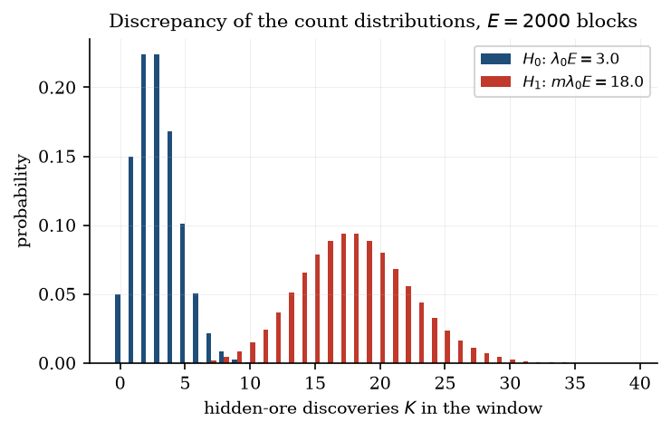
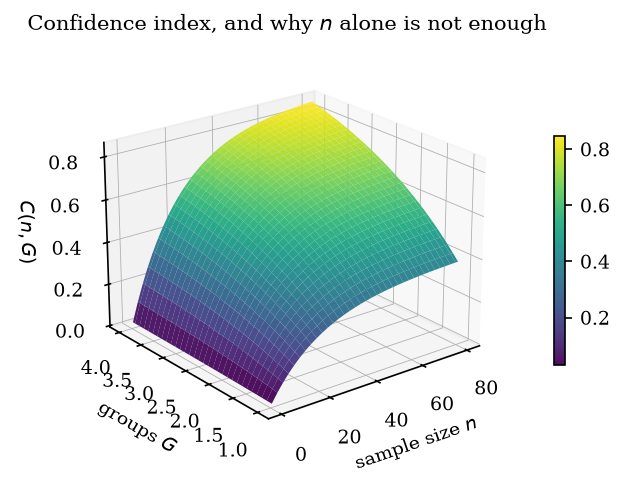
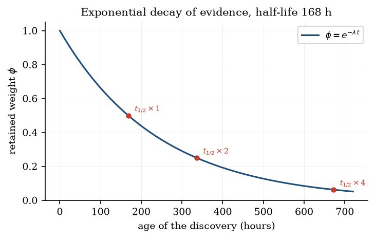
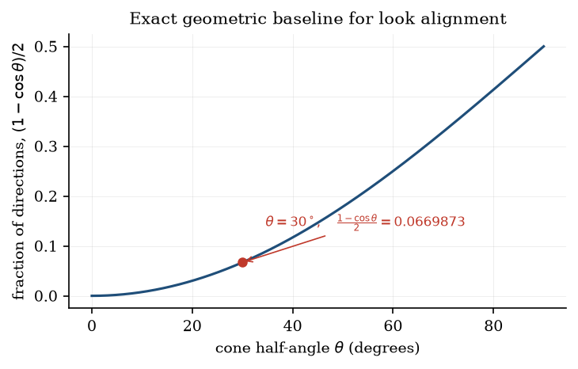
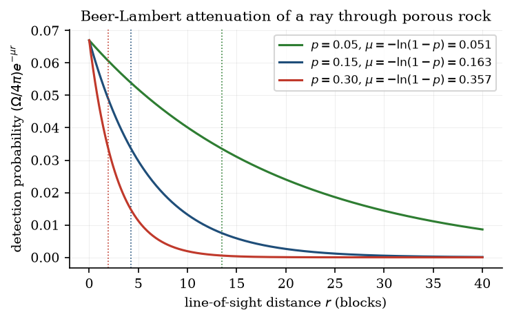
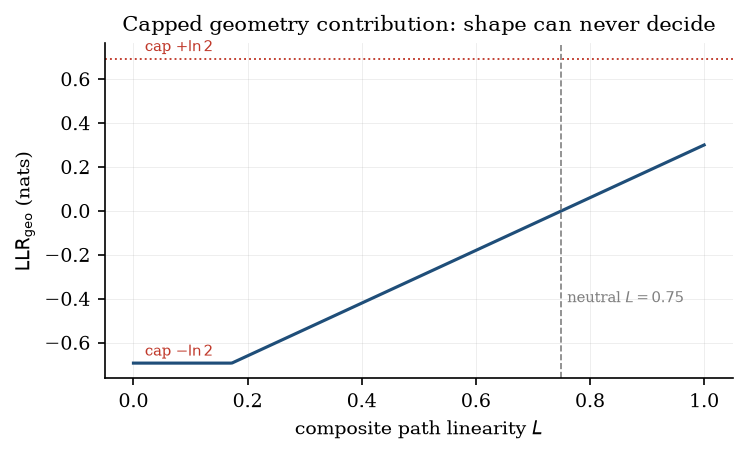
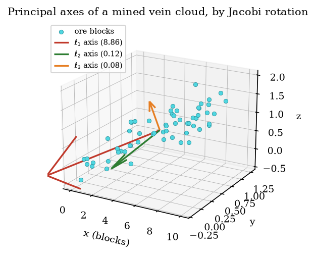

# Rapporti di verosimiglianza normalizzati sull'esposizione per il rilevamento del cheating di tipo ore-vision nella telemetria dei server di mondi voxel

**Ambercode**

*Rapporto tecnico XRAY-TR-1, revisione 1.0.1*

---

## Riassunto

Il cheating di tipo ore-vision, con cui un giocatore ottiene la conoscenza della posizione dei
minerali che non avrebbe potuto acquisire giocando, è difficile da rilevare perché il
comportamento che produce non è cinematicamente impossibile. Chi bara cammina, scava e combatte
nel rispetto delle regole; soltanto l'informazione su cui agisce è illecita. I sistemi
anti-cheat che rispondono a questo problema contando il minerale per unità di tempo, oppure
segnalando le gallerie rettilinee, confondono un giocatore fortunato con uno informato e
producono accuse che non si possono sostenere davanti all'accusato. Descriviamo un impianto di
rilevamento che riformula il problema come un test del rapporto di verosimiglianza fra due
ipotesi, valutato rispetto a un'esposizione misurabile, e presentiamo il programma di verifica
software costruito attorno a esso.

L'impianto assume cinque impegni progettuali. L'esposizione è misurata in blocchi di roccia
rimossi anziché in tempo trascorso, il che elimina come fattori di confondimento la velocità di
scavo, la qualità degli strumenti e le pause di inattività. L'evidenza si accumula nello spazio
dei log-odds naturali a partire da cinque segnali componenti organizzati in quattro gruppi
indipendenti, con un termine di penalità esplicito che cresce con l'esposizione, così che aver
scavato molto con un numero proporzionato di ritrovamenti non venga trattato come sospetto. I
campioni piccoli sono contratti verso l'ipotesi nulla da un fattore $n/(n+\kappa)$. Dove una
soglia di riferimento può essere derivata invece che tarata, viene derivata: la probabilità che
una linea di sguardo priva di intento cada dentro un cono di semiapertura $30^\circ$ è la
frazione esatta di angolo solido $(1-\cos\theta)/2 = 0{,}0669873$, non una costante adattata.
Infine, il livello decisionale richiede sia una fascia di evidenza sia una soglia di confidenza
statistica prima di qualunque azione irreversibile, e una misura mancante viene esclusa dalla
verosimiglianza anziché essere accreditata a favore del giocatore.

Valutiamo l'impianto in tre modi che i dati disponibili consentono: analiticamente, attraverso
due finestre interamente svolte che differiscono soltanto nel comportamento e che il modello
separa di 50,5 nat di log-odds a posteriori; comportamentalmente, attraverso una suite di 177
test automatici in cui giocatori sintetici si comportano da esploratori di caverne, da minatori a
strisce, da minatori a rami e da cercatori informati di minerali, suite scritta come specifica
delle decisioni che quei giocatori devono ricevere; e in modo avversariale, attraverso un caso di
studio in cui una regola ingenua a livello di vena produsse evidenza fortemente incriminante, un
rapporto di verosimiglianza di $0{,}997$, contro un giocatore legittimo, e in cui la correzione
della regola di aggregazione ridusse la stessa evidenza a $1{,}6\times10^{-11}$. Diciamo
esplicitamente che non è stata condotta alcuna sperimentazione sul campo, che non esiste alcuna
verità di riferimento etichettata e che il sistema non pubblica alcun tasso di falsi positivi,
perché nessuno può essere stimato senza tali dati. Il rapporto sviluppa inoltre la geometria della visibilità come modello fisico esplicito, in cui la soglia di riferimento per l'allineamento casuale è un fattore di vista esatto e l'occlusione è attenuazione di Beer-Lambert con un coefficiente di estinzione fissato dalla porosità della roccia, e presenta tredici figure che mostrano il comportamento del modello anziché nuove misure. Il contributo è una costruzione statistica
difendibile e un resoconto onesto dei suoi limiti.

**Parole chiave:** rapporto di verosimiglianza, log-odds, valutazione forense dell'evidenza,
rilevamento sequenziale, cheating ore-vision, normalizzazione sull'esposizione, prudenza
epistemica

---

## 1. Introduzione

Un giocatore che scava in un mondo Minecraft rimuove blocchi e, così facendo, occasionalmente
espone del minerale. Il minerale è generato dal generatore di mondo secondo regole che il server
conosce esattamente e che il giocatore conosce approssimativamente. Il cheating della famiglia
ore-vision, che comprende le modifiche al client capaci di rendere visibile il minerale
attraverso la roccia piena e gli strumenti che riportano le coordinate dei minerali vicini,
fornisce al giocatore direttamente l'uscita del generatore. Il giocatore scava allora verso
minerale che vede ma che il server non ritiene che possa vedere, e il risultato è
indistinguibile dal gioco ordinario al livello delle singole azioni. La rottura del blocco è
legittima, il movimento è legittimo, il cambiamento dell'inventario è legittimo.

Il problema di rilevamento, dunque, non è un problema di individuazione dell'impossibile, che è
come vengono solitamente scoperti gli aimbot e i trucchi di volo, ma un problema di inferenza dal
comportamento all'informazione. Questa distinzione determina l'intera forma di una soluzione
praticabile. Un rilevatore non può indicare un evento e affermare che quell'evento non poteva
accadere; può soltanto accumulare un corpo di osservazioni e dichiarare quanto quel corpo sia più
probabile sotto l'ipotesi che il giocatore fosse informato rispetto all'ipotesi che non lo fosse.
Questa è la formulazione classica del rapporto di verosimiglianza usata nelle scienze forensi per
pesare l'evidenza, e comporta un obbligo che i rilevatori basati su eventi non hanno: il rapporto
deve essere interpretato, non semplicemente confrontato con una soglia, e chi lo usa deve poter
vedere su che cosa il numero si fonda.

I sistemi che ignorano questa impostazione falliscono in due modi caratteristici. Il primo è il
contatore di frequenza, che segnala un giocatore perché trova troppo minerale all'ora. I contatori
di frequenza si eludono scavando più lentamente, giocando con strumenti peggiori o restando
inattivi, e si attivano anche su un giocatore che si trovi a lavorare un filone ricco. Il secondo
è l'euristica sulla forma, che segnala le gallerie rettilinee, in base all'idea che chi bara scavi
in modo efficiente verso il minerale. Le euristiche sulla forma si eludono scavando in modo
inefficiente, e si attivano su ogni minatore a strisce competente, gruppo che comprende una
frazione consistente e piuttosto rumorosa della popolazione di qualunque server survival. Entrambi
gli approcci condividono il difetto più profondo di affidare a un'unica statistica sufficiente una
affermazione che è intrinsecamente multivariata.

L'impianto qui descritto è stato progettato per un plugin lato server, e i suoi vincoli sono
quelli di quel contesto. Deve funzionare su un server in esercizio senza perturbare la cadenza dei
tick. Deve sopravvivere ai riavvii, perché la condotta di un giocatore si accumula fra sessioni e
un rilevatore che dimentica ogni notte viene eluso banalmente giocando a brevi riprese. Non deve
richiedere dati etichettati per l'addestramento, che nessun gestore di server possiede. E deve
essere prudente in una direzione specifica, perché il costo di una falsa accusa per una comunità
supera il costo di un rilevatore mancato, e perché un operatore a cui venga consegnato un
punteggio inesplicabile o ignorerà lo strumento o ne abuserà.

### 1.1 Contributi

Il contributo di questo lavoro è una costruzione, non una scoperta. Presentiamo un modello a
rapporto di verosimiglianza per il rilevamento ore-vision in cui la misura di esposizione è
costituita dai blocchi rimossi anziché dal tempo, in cui cinque segnali sono combinati nello
spazio dei log-odds entro una struttura esplicita di gruppi di indipendenza, in cui una soglia di
riferimento geometrica di principio sostituisce una costante tarata per una classe di evidenza, e
in cui il livello decisionale separa la forza dell'evidenza dall'adeguatezza della misura.
Accompagniamo la costruzione con due finestre svolte che ne mostrano il comportamento su
quantità realistiche, con un programma di verifica software che codifica le decisioni attese come
asserzioni eseguibili, e con un caso documentato in cui una regola a livello di vena
apparentemente ragionevole generò evidenza spuria e venne corretta.

Riferiamo inoltre un risultato negativo di un certo valore. Non è possibile, con i dati che un
gestore di server effettivamente possiede, stimare il tasso di falsi positivi di un rilevatore di
questo tipo. Ci asteniamo quindi dal pubblicarne uno e descriviamo invece i meccanismi con cui il
progetto innalza il costo di una falsa accusa e i punti specifici in cui la molteplicità fra
valutazioni resta non affrontata.

---

## 2. Lavori correlati

L'apparato statistico qui impiegato è standard e antico. Il test del rapporto di verosimiglianza
per due ipotesi semplici si deve a Neyman e Pearson [1]; il suo uso come misura del peso
dell'evidenza, e la scala logaritmica che rende additivi i contributi indipendenti, si devono a
Good [2] e ricevettero le loro fasce verbali ormai convenzionali da Jeffreys [3]. Le scienze
forensi hanno adottato formalmente questa scala; la linea guida ENFSI per la valutazione
dell'evidenza [4] raccomanda esattamente il vocabolario di debole, moderato, forte e molto forte
che adottiamo, sulla base del fatto che una scala consolidata consente all'intuito di chi la usa
di trasferirsi fra domini e, cosa più importante, mantiene la quantità inequivocabilmente come
forza dell'evidenza anziché come presunta frequenza di colpevoli. Kass e Raftery [5] passano in
rassegna l'interpretazione dei fattori di Bayes e le ragioni per cui tali rapporti vengono
abitualmente letti, a torto, come tassi di errore. L'impianto del modello attorno a un processo di
Poisson, e il trattamento degli intervalli noti soltanto per superare un limite, seguono la teoria
standard dei processi puntuali e della censura [6]. Il problema dei confronti multipli, che
discutiamo senza risolverlo, è oggetto della nota letteratura sull'errore per famiglia e sulla
scoperta dei falsi [7], e la preoccupazione più ampia che una ricerca condotta su molte analisi
produca risultati non replicabili è esposta da Ioannidis [8]. La decomposizione spettrale usata
per caratterizzare la forma delle gallerie è l'analisi delle componenti principali classica [9],
calcolata con il metodo ciclico di Jacobi [10], che resta una scelta attraente per matrici
simmetriche piccole e di dimensione fissa.

Il dominio applicativo ha una letteratura propria, ma è in gran parte non statistica. L'anti-cheat
lato server per i giochi voxel è dominato dall'analisi del movimento, che è trattabile perché il
server è autoritativo sulla posizione e può respingere senz'altro traiettorie fisicamente
impossibili. Il rilevamento ore-vision non ha tale autorità e di conseguenza attrae euristiche del
tipo descritto nella Sezione 1. A nostra conoscenza il problema non è stato in precedenza
formulato come test del rapporto di verosimiglianza rispetto a una normalizzazione
sull'esposizione, e nessun sistema pubblicato separa la forza della propria evidenza
dall'adeguatezza del campione su cui essa poggia. La seconda separazione è, a nostro giudizio, la
più utile delle due nella pratica.

---

## 3. Formulazione del problema

### 3.1 Grandezze osservabili

Il server osserva, e l'impianto utilizza, cinque quantità che sono o registrate direttamente o
ricostruite a partire dallo stato archiviato. Il movimento e l'orientamento, campionati come
percorso di posizioni e di vettori di sguardo. Le rimozioni di blocchi, ciascuna con posizione,
tipo di blocco, istante e attore, il che consente di distinguere e di tener conto della rimozione
di un blocco da parte di un giocatore diverso da quello in esame. Lo stato del mondo nel momento
in cui un minerale viene scoperto, che determina se quel minerale fosse visibile da qualche
posizione che il giocatore poteva legittimamente occupare. L'identità e la geometria della vena
connessa a cui appartiene il blocco scoperto. E la storia archiviata dei ritrovamenti precedenti
del giocatore, che è ciò che permette alla costruzione di sopravvivere a un riavvio.

Da queste grandezze ogni ritrovamento viene classificato in uno stato di esposizione. Il minerale
pienamente esposto è visibile dal gioco ordinario. Il minerale parzialmente esposto è visibile da
alcune posizioni ma non da quella occupata. Il minerale esposto in modo condizionato è stato
raggiunto attraverso una galleria precedente allo scavo del giocatore, cosicché la sua visibilità
è attribuibile a chi ha scavato quella galleria. Il minerale nascosto non era visibile da alcuna
posizione che il giocatore potesse occupare. La classificazione è prudente in un senso specifico
che conta: l'analizzatore percorre punti di campionamento fra i centri dei blocchi anziché
eseguire il raycast proprio del motore di gioco, e di conseguenza i suoi errori sono del tipo che
declassa un verdetto di minerale nascosto verso uno più visibile. L'approssimazione può quindi
soltanto rendere il sistema più indulgente verso il giocatore, mai meno, e questa asimmetria è
deliberata anziché accidentale.

### 3.2 Ipotesi

Consideriamo due ipotesi su un singolo giocatore, in un singolo mondo, su una singola finestra di
analisi.

Sotto $H_0$ il giocatore scava in modo legittimo. Scopre minerale nascosto alla frequenza che un
minatore onesto avrebbe, date le caratteristiche del terreno e la quantità di roccia rimossa. La
sua direzione di marcia e il suo orientamento della telecamera sono governati dall'esplorazione
ordinaria, non dalla conoscenza della posizione dei minerali. La sua miscela di ritrovamenti
nascosti ed esposti corrisponde alla distribuzione che il generatore di mondo e il gioco ordinario
producono.

Sotto $H_1$ il giocatore ha accesso a informazioni sulla posizione dei minerali che non avrebbe
potuto ottenere giocando. Questo innalza la frequenza con cui trova minerale nascosto per blocco
mosso, orienta la sua direzione di arrivo e il suo sguardo verso minerale che non può ancora
vedere, e sposta la sua miscela di ritrovamenti verso quelli nascosti. Non predice, e questo è
importante, alcuna particolare forma di galleria. La ricerca del minerale attraverso la roccia e
lo scavo sistematico a strisce producono entrambi gallerie lunghe e rettilinee, e un modello che
trattasse la rettilineità come prova di ore-vision condannerebbe il minatore a strisce.

La ristrettezza di $H_1$ è una restrizione deliberata. L'impianto è un test per il cheating
orientato ai minerali e per nient'altro. Un giocatore che usa il volo, o l'allungamento del
braccio, o un aimbot, non è modellato e non alzerà il punteggio. Dirlo apertamente non è tanto un
limite del metodo quanto una descrizione del suo ambito, e impedisce il guasto comune in cui un
punteggio composito di sospetto viene messo insieme a partire da segnali non correlati e non è più
spiegabile a nessuno.

### 3.3 Vincoli di progetto

Quattro vincoli hanno dato forma alla costruzione. Il rilevatore deve essere abbastanza economico
da girare sui thread di analisi del server senza incidere sulla cadenza dei tick, il che esclude
qualunque approccio che richieda inferenza a ogni tick su uno spazio di stato ampio. Deve
funzionare in assenza di dati etichettati, il che esclude l'apprendimento supervisionato e
qualunque calibrazione delle soglie su imbroglioni noti. Deve conservare le proprie conclusioni
attraverso i riavvii restando al tempo stesso ricalcolabile, così che un verdetto vecchio possa
essere riesaminato anziché semplicemente creduto. E deve fallire nel senso dell'indulgenza in
condizioni di incertezza, così che un'informazione mancante produca un contributo non informativo
anziché una rozza inferenza in una delle due direzioni.

---

## 4. Il modello dell'evidenza

In tutto il testo l'evidenza si accumula nello spazio dei log-odds naturali. Un contributo
$\mathrm{LLR} = \ln[P(\text{dati}\mid H_1)/P(\text{dati}\mid H_0)]$ è positivo quando
l'osservazione favorisce lo scavo informato, negativo quando favorisce lo scavo legittimo e nullo
quando è non informativa. L'additività dei log-odds sotto indipendenza è ciò che rende trattabile
una costruzione a più segnali, e la struttura di gruppi della Sezione 4.5 esiste proprio perché
quell'indipendenza è un'assunzione che il progettista deve difendere attivamente anziché dare per
scontata.

### 4.1 L'esposizione come grandezza di normalizzazione

La componente di frequenza divide un conteggio di ritrovamenti nascosti per una misura di
esposizione. La scelta di quella misura è la decisione di modellazione più consequenziale
dell'intero impianto, e noi la identifichiamo con $E$, il numero di blocchi che il giocatore ha
rimosso nella finestra, anziché con il tempo trascorso.

La ragione è il confondimento. Il tempo di orologio è intrecciato con la velocità di scavo, e la
velocità di scavo dipende dagli incantesimi degli strumenti, dagli effetti di rapidità, dal ritardo
del server, dal fatto che il giocatore si sia fermato a costruire e da quanto a lungo sia rimasto
connesso. Un giocatore con un piccone di efficienza cinque rimuove diverse volte i blocchi
all'ora di un giocatore che non ne ha uno, e una frequenza espressa per ora confronta quindi
strategie anziché condotte. I blocchi rimossi sono una proprietà del terreno e della strategia di
scavo del giocatore, e sono confrontabili fra giocatori i cui strumenti e la cui durata di
sessione differiscono. Il tempo entra nel modello soltanto come decadimento, mai come misura dello
sforzo.

Una seconda conseguenza dell'uso dell'esposizione è che il rapporto di verosimiglianza acquisisce
un termine di penalità che cresce con la quantità di scavo effettuata. È questo il meccanismo che
impedisce che un giocatore produttivo e onesto venga segnalato soltanto per aver scavato molto, e
lo sviluppiamo nella sezione seguente.

### 4.2 Modello di conteggio

Modelliamo il numero di ritrovamenti di minerale nascosto $K$ su un'esposizione $E$ come
poissoniano, con frequenza $\lambda_0$ per blocco sotto $H_0$ e $\lambda_1 = m\lambda_0$ sotto
$H_1$, dove $m$ è un moltiplicatore specifico del minerale. Scrivendo il logaritmo della funzione
di massa $\ln p(k;\lambda E) = k\ln(\lambda E) - \lambda E - \ln k!$ e sottraendo il termine di
$H_0$ da quello di $H_1$, il termine fattoriale si elide perché le due ipotesi condividono lo
spazio delle osservazioni, e si ottiene

$$\mathrm{LLR} = k \ln\frac{\lambda_1}{\lambda_0} - (\lambda_1 - \lambda_0)E.$$

Il secondo termine non dipende dal conteggio osservato e cresce linearmente con l'esposizione. È
una penalità per aver scavato molta roccia senza un numero corrispondente di ritrovamenti, ed è
ciò che distingue questo modello da un contatore di frequenza. Il rapporto di verosimiglianza
attraversa lo zero in corrispondenza di

$$k^{\star} = E\,\frac{\lambda_1-\lambda_0}{\ln(\lambda_1/\lambda_0)},$$

cioè a una frequenza di $(\lambda_1-\lambda_0)/\ln(\lambda_1/\lambda_0)$ per blocco. Con il
valore a priori per il diamante fornito in dotazione, $\lambda_0 = 1{,}5\times10^{-3}$ per blocco,
e moltiplicatore $m=6$, il punto di incrocio cade a $0{,}0075/1{,}7918 = 4{,}19\times10^{-3}$ per
blocco, ossia a $4{,}19$ ritrovamenti ogni mille blocchi scavati. Ciò corrisponde a circa $2{,}79$
volte il valore a priori legittimo. Un giocatore deve quindi superare la frequenza a priori di
quasi un fattore tre prima che si accumuli un qualsiasi contributo positivo, e la taratura del
valore a priori e del moltiplicatore è il luogo in cui quel margine viene fissato.

La componente restituisce un contributo non informativo, anziché uno fortemente negativo, quando
non viene registrato alcun ritrovamento nascosto. Un conteggio nullo a fronte di un'attesa
positiva produrrebbe altrimenti un sostanziale termine discolpante, e accreditare un giocatore per
non essere stato ancora osservato sarebbe un errore del tipo che si accumula: quanto più accurata
è la sorveglianza, tanto maggiore sarebbe la discolpa che essa fabbrica.

### 4.3 Modelli binari

Due segnali sono genuinamente binari e usano un rapporto di verosimiglianza binomiale. Per $k$
successi in $n$ prove indipendenti, il coefficiente binomiale si elide fra le ipotesi e

$$\mathrm{LLR} = k\ln\frac{p_1}{p_0} + (n-k)\ln\frac{1-p_1}{1-p_0}.$$

La prima applicazione è la miscela di esposizione. Di $n$ ritrovamenti classificati, $k$ erano
sepolti, con $p_0 = 0{,}55$ e $p_1 = 0{,}95$ come frazioni nascoste legittima e informata. La
seconda applicazione è il puntamento, in cui ogni vena sepolta con un avvicinamento misurabile
contribuisce con una prova di Bernoulli per segnale, una per stabilire se la direzione di
movimento in arrivo giaceva entro $30^\circ$ dal minerale e una per stabilire se vi giaceva la
direzione dello sguardo.

L'indipendenza delle prove è un'assunzione che il chiamante deve sostenere, ed è facile violarla.
Le vene di un mondo sono collocate da un generatore che raggruppa il minerale, sicché i blocchi
dentro una stessa vena sono fortemente correlati in posizione e in esposizione. Contare le prove
per blocco sarebbe pseudo-replicazione, gonfiando la dimensione campionaria apparente di un
fattore pari alla dimensione media della vena senza apportare alcuna informazione nuova.
L'impianto conta quindi un'occasione per vena, mai per blocco, e la contabilità delle dimensioni
campionarie della Sezione 4.6 dipende da quella regola.

### 4.4 Tempi di attesa e censura

Se i ritrovamenti arrivano come processo di Poisson, gli intervalli fra essi sono esponenziali, e
questo modello condivide quindi le proprie assunzioni con la Sezione 4.2 anziché costituire un
controllo indipendente. Per un intervallo osservato $x$ la densità logaritmica è $\ln r - rx$, e
per un intervallo noto soltanto per superare $x$, perché la finestra è terminata prima, il
contributo è il logaritmo della funzione di sopravvivenza $-rx$. Sommando su $n_{\text{oss}}$
intervalli osservati e su quelli eventualmente censurati,

$$\mathrm{LLR} = n_{\text{oss}}\ln\frac{r_1}{r_0} - (r_1-r_0)T, \qquad T = \sum_{\text{oss}}x +
\sum_{\text{cens}}x,$$

che è algebricamente la stessa forma lineare del modello di conteggio con $k = n_{\text{oss}}$ e
$E=T$. I due non sono quindi evidenza indipendente, e la Sezione 4.5 li raggruppa di conseguenza.

Il trattamento dell'intervallo finale merita un commento, perché è un caso in cui
un'implementazione intuitiva risulta distorta. L'ultimo intervallo, che va dall'ultimo
ritrovamento alla fine della finestra, è lo sforzo durante il quale non si è trovato nulla.
Scartarlo, come farebbe naturalmente un'implementazione incentrata sui tempi fra un ritrovamento e
l'altro, lascerebbe nella somma soltanto gli intervalli produttivi e accorcerebbe quindi l'attesa
media osservata. Un'attesa media più breve si legge come frequenza di ritrovamento più alta, che è
evidenza a favore di $H_1$. Omettere l'intervallo finale fabbricherebbe quindi sospetto, e
l'impianto lo aggiunge esplicitamente come osservazione censurata a destra. Quando una finestra
non contiene alcun ritrovamento, il suo intero sforzo diventa un'unica osservazione censurata.

### 4.5 Gruppi di indipendenza

Cinque componenti contribuiscono, e sono organizzate in quattro gruppi. Il gruppo della frequenza
di ritrovamento contiene il modello di conteggio e il modello dei tempi di attesa, che la Sezione
4.4 ha mostrato essere quasi ridondanti nel caso semplice. Il gruppo del puntamento contiene i
segnali di allineamento. Il gruppo della miscela di esposizione contiene il segnale sulla frazione
sepolta. Il gruppo della geometria contiene il contributo sulla forma della galleria.

Dentro un gruppo i contributi pesati si sommano; fra i gruppi si sommano le somme di gruppo.
Questo è uno strumento più grossolano di un modello completo di covarianza, e non sosteniamo il
contrario. Il suo scopo è impedire che lo stesso evento sottostante venga contato due volte sotto
due nomi, che è il modo più comune in cui un rilevatore a più segnali gonfia silenziosamente la
propria confidenza. Il raggruppamento è dichiarato dalle componenti e non stimato dai dati, e
l'assunzione che i quattro gruppi siano essi stessi indipendenti non è verificata.

### 4.6 Pesatura, contrazione e decadimento

Ogni componente riporta un rapporto di verosimiglianza insieme a una dimensione campionaria e a
un'affidabilità $r_i \in [0,1]$ che esprime la fiducia intrinseca del modello in quel segnale. Le
affidabilità fornite in dotazione sono $0{,}8$ per il modello di conteggio, $0{,}7$ per il tempo
di attesa, $0{,}75$ per il puntamento, $0{,}6$ per la miscela di esposizione e $0{,}4$ per la
geometria. Il contributo pesato è $w_i = r_i\,\mathrm{LLR}_i$, e i contributi con campione nullo,
affidabilità nulla o rapporto nullo vengono esclusi anziché sommati come zeri.

Il totale grezzo $R = \sum_g \sum_{i \in g} w_i$ viene poi contratto verso l'ipotesi nulla da un
unico scalare

$$s(n) = \frac{n}{n+\kappa}, \qquad \kappa = 5,$$

dove $n$ è la dimensione campionaria. I valori sono $s(1) = 0{,}167$, $s(5) = 0{,}5$,
$s(10) = 0{,}667$ e $s(50) = 0{,}909$. L'intento è che un rapporto di verosimiglianza nominale
sia il valore che una componente porterebbe se il modello fosse esatto e il campione ampio, e che
con due osservazioni non lo si debba prendere per buono. È questo il meccanismo che impedisce a
tre ritrovamenti fortunati di produrre un punteggio clamoroso, ed è deliberatamente non una
correzione di significatività: non porta alcuna garanzia di copertura ed è meglio inteso come un
valore a priori regolarizzante secondo cui la verità è vicina all'ipotesi nulla quando i dati sono
scarsi.

Una sottigliezza va registrata anziché levigata. La contrazione è applicata una sola volta
all'intera somma e usa la dimensione campionaria massima fra i gruppi, sicché un campione ampio in
una famiglia attenua parzialmente la contrazione applicata all'evidenza di ogni altra famiglia.
Questa è una semplificazione, e uno stimatore corretto per l'errore applicato per gruppo sarebbe
un modello diverso e verosimilmente migliore.

Il decadimento è applicato dentro la finestra come peso esponenziale medio dei suoi ritrovamenti,

$$\phi = \frac{1}{|D|}\sum_{d\in D} e^{-\lambda\,\mathrm{età}(d)}, \qquad \lambda =
\frac{\ln 2}{t_{1/2}},$$

con emivita $t_{1/2} = 168$ ore, cosicché $\lambda = 4{,}1259\times10^{-3}$ per ora e un
ritrovamento vecchio di una settimana porta metà del proprio peso. La forma esponenziale è stata
scelta per l'assenza di memoria, poiché la frazione di peso perduta nell'ora successiva non
dipende allora da quanto vecchia sia già l'osservazione, e perché è il coniugato naturale del
processo di Poisson che ha generato i ritrovamenti. Un taglio netto è stato respinto perché
creerebbe un salto in corrispondenza del quale il punteggio cala in modo discontinuo, cosa che è
insieme sorprendente per un amministratore e sfruttabile rimandando fino a che il taglio sia
passato. L'istante di valutazione è passato esplicitamente anziché letto dall'orologio, così che
il riesame di una finestra archiviata riproduca il verdetto storico invece di applicarvi
silenziosamente un nuovo decadimento.

### 4.7 Distribuzione a posteriori e punteggio riportato

L'accumulo effettivo è $\Delta = R\,s(n)\,\phi$, i log-odds a posteriori sono
$P = \mathrm{clamp}(\rho + \Delta, -30, 30)$ con valore a priori
$\rho = \ln(0{,}02/0{,}98) = -3{,}8918$, e il punteggio di sospetto riportato è la trasformazione
logistica $\pi = \sigma(P)$.

Il taglio a modulo trenta corrisponde a una probabilità entro $10^{-13}$ dalla certezza e giace
molto oltre qualunque soglia decisionale, sicché non cambia mai un verdetto. Esiste perché una
lunga serie di evidenza non possa far traboccare l'esponenziale, e perché una singola osservazione
schiacciante non possa fissare la distribuzione a posteriori esattamente a uno e congelare così il
modello contro evidenza contraria successiva. La trasformazione in probabilità è implementata in
forma stabile per rami anziché come logistica ingenua, per evitare il trabocco per argomenti molto
negativi e la cancellazione per argomenti molto positivi.

### 4.8 Confidenza

L'impianto riporta, separatamente dalla forza dell'evidenza, un indice di quanta misura stia
dietro di essa:

$$C(n,G) = \left(1-e^{-n/n_0}\right)\left(1-e^{-G/g_0}\right), \qquad n_0 = 20,\; g_0 = 2,$$

dove $n$ è la dimensione campionaria e $G$ il numero di gruppi indipendenti che hanno contribuito.
Il primo fattore cresce con il numero di osservazioni indipendenti e satura, raggiungendo
$0{,}632$ a $n = 20$ e $0{,}950$ a $n = 60$. Il secondo cresce con il numero di famiglie di
segnali distinte, raggiungendo $0{,}865$ a $G = 2$ e $0{,}982$ a $G = 4$. Il loro prodotto
codifica il principio secondo cui una grande quantità di dati provenienti da una sola famiglia non
può sostituire la corroborazione proveniente da un'altra: cento osservazioni in un unico gruppo
danno $C = 0{,}007 \times 0{,}393 = 0{,}003$. Entrambi i fattori si avvicinano all'unità senza
raggiungerla, perché l'incertezza residua su un'inferenza comportamentale non svanisce mai e un
sistema che dichiarasse certezza assoluta starebbe rappresentando male se stesso.

Sottolineiamo che $C$ è un indice euristico e non una probabilità a posteriori né un livello di
copertura. Risponde alla domanda «quanto abbiamo guardato», mentre $\pi$ risponde a «in quale
direzione punta ciò che abbiamo visto». Tenerli in campi separati è deliberato, perché un
punteggio alto con confidenza bassa significa qualcosa che un operatore deve sapere: il
comportamento è sorprendente ma la base di osservazione è sottile.

### 4.9 Fasce di forza

Le fasce sono definite sui log-odds a posteriori anziché sulla percentuale di sospetto, perché una
scala di probabilità comprime proprio la regione in cui vivono le distinzioni di interesse;
$0{,}99$ e $0{,}999$ sono adiacenti su un asse di probabilità ma distano un ordine di grandezza
come evidenza. Una probabilità invita inoltre il lettore a trattare il numero come una frequenza,
cosa che non è.

| Fascia | Condizione | Rapporto di verosimiglianza nominale |
| --- | --- | --- |
| molto forte | $P \ge \ln 1000$ | $1000$ |
| forte | $P \ge \ln 100$ | $100$ |
| moderata | $P \ge \ln 10$ | $10$ |
| debole | $P \ge \ln 3$ | $3$ |
| insufficiente | $P < \ln 3$, oppure condizioni non soddisfatte | non applicabile |

Le condizioni di ammissibilità sono una dimensione campionaria minima di dieci e un minimo di due
gruppi indipendenti; se una delle due non è soddisfatta il verdetto è insufficiente,
indipendentemente da quanto grande diventi $P$. Le etichette e le soglie seguono la scala verbale
usata nella pratica forense [4], che adottiamo perché l'intuito di un moderatore si trasferisca da
altri domini e perché la quantità sia inequivocabilmente una forza dell'evidenza.

Due avvertenze appartengono a questa sede anziché a una nota a piè di pagina. In primo luogo, le
soglie sono confrontate con $P = \rho + \Delta$, che include il valore a priori, sicché una fascia
etichettata con un rapporto di verosimiglianza è in realtà una soglia su odds a posteriori; la
fascia debole, per esempio, richiede $\Delta \ge \ln 3 + 3{,}8918 = 4{,}990$. È una
semplificazione deliberata e non un errore di normalizzazione, ma significa che le etichette
sovrastimano la forza del rapporto sottostante. In secondo luogo, un fattore di Bayes non è un
valore p. Un rapporto di verosimiglianza di mille non significa un falso positivo su mille, e
convertirlo in un tasso di errore richiede un valore a priori e una funzione di perdita che questa
costruzione non specifica. Un giocatore il cui comportamento depone contro $H_1$ produce un $P$
fortemente negativo e cade nello stesso ramo dell'insufficienza, il che è voluto: etichettare
un'evidenza discolpante come sospetto debole si leggerebbe come una lieve accusa in un rapporto di
moderazione.

### 4.10 Perché le componenti hanno questa forma

Le espressioni delle Sezioni da 4.2 a 4.8 non sono scelte convenzionali. Ognuna risponde a una
esigenza dichiarata, e questa sezione enuncia l'esigenza e svolge la derivazione, così che un
lettore possa dissentire da una decisione di modellazione nel punto in cui è stata presa anziché
doverla ricostruire a ritroso.

**Neyman-Pearson come ragione dell'uso di un rapporto.** Fra tutte le prove di $H_0$ contro $H_1$
la cui probabilità di rifiutare $H_0$ quando $H_0$ è vera non supera un livello fissato, la prova
che rifiuta per valori grandi del rapporto di verosimiglianza è la più potente [1]. Scrivendo
$\Lambda = p(\mathrm{dati}\mid H_1)/p(\mathrm{dati}\mid H_0)$ e passando ai logaritmi, che sono
monotoni e conservano quindi l'ordinamento dell'evidenza, ogni soglia sulla forza dell'evidenza
diventa una soglia su $\ln\Lambda$. Il logaritmo è anche l'unità in cui i contributi indipendenti
si sommano, ed è ciò che permette di combinare cinque segnali per addizione. È questa la ragione
per cui l'impianto accumula un log-rapporto di verosimiglianza e non, poniamo, una somma pesata di
punteggi normalizzati: una somma pesata di punteggi non ha alcuna lettura come peso dell'evidenza e
non può essere spiegata a un giocatore accusato.

**Il rapporto poissoniano.** Sia il numero di ritrovamenti di minerale nascosto su un'esposizione
$E$ distribuito secondo Poisson con media $\lambda E$ sotto ciascuna ipotesi. Il rapporto di
verosimiglianza è allora

$$ \frac{p(k\mid H_1)}{p(k\mid H_0)} = \frac{(\lambda_1 E)^k e^{-\lambda_1 E}/k!}{(\lambda_0 E)^k e^{-\lambda_0 E}/k!} $$

e il fattore $k!$ compare al numeratore e al denominatore perché entrambe le ipotesi descrivono le
stesse osservazioni sullo stesso spazio, sicché si elide. Passando ai logaritmi resta
$k\ln(\lambda_1/\lambda_0) - (\lambda_1-\lambda_0)E$, che è la (4.2). L'elisione non è estetica: è
la ragione per cui il modello di conteggio non necessita di costanti di normalizzazione, ed è la
stessa elisione che rende il modello dei tempi di attesa della Sezione 4.4 algebricamente
identico a esso.

**Perché l'esposizione e non il tempo, in una riga.** Sotto $H_0$ il conteggio atteso è
$\lambda_0 E$. Se $E$ fosse sostituito dal tempo trascorso $t$, il parametro sottoposto a prova
diventerebbe la frequenza di ritrovamento per ora, che è funzione degli strumenti, degli effetti di
rapidità e del ritardo del server non meno che della condotta. Il punto di incrocio
$k^{\star} = E(\lambda_1-\lambda_0)/\ln(\lambda_1/\lambda_0)$ cresce allora con l'esposizione
anziché essere fisso, ed è questa la formulazione formale dell'affermazione della Sezione 4.1
secondo cui la mera produttività non è evidenza.

**La contrazione come peso di una distribuzione a posteriori coniugata.** Il fattore
$s(n) = n/(n+\kappa)$ viene di solito introdotto come euristica di livellamento. Esso ha una
derivazione. Sia la frequenza incognita per blocco $\lambda$ dotata di un prior Gamma
$\lambda \sim \mathrm{Gamma}(\alpha, \beta)$ di media $\alpha/\beta$. Dopo aver osservato $k$
ritrovamenti su un'esposizione $E$ la distribuzione a posteriori è
$\mathrm{Gamma}(\alpha + k, \beta + E)$ di media

$$ \mathbb{E}[\lambda \mid k, E] = \frac{\alpha+k}{\beta+E} = \frac{\beta}{\beta+E}\cdot\frac{\alpha}{\beta} + \frac{E}{\beta+E}\cdot\frac{k}{E}, $$

sicché la stima dai dati $k/E$ riceve peso $E/(\beta+E)$ e la media del prior riceve il resto. La
forma fornita in dotazione è lo stesso oggetto scritto in dimensione campionaria anziché in
esposizione, con $\kappa$ che rappresenta il numero di pseudo-osservazioni cui il prior equivale:
con $n = 5$ osservazioni i dati ricevono metà del peso, e con $n = 50$ ne ricevono $0{,}909$. La
scelta $\kappa = 5$ è quindi l'affermazione che il prior vale circa cinque osservazioni, non una
costante arbitraria. Una precisazione onesta appartiene a questa sede: la derivazione giustifica la
forma funzionale, e l'implementazione la applica poi moltiplicativamente a un log-rapporto anziché
a una stima di frequenza, il che è una decisione di modellazione e non una conseguenza della
derivazione.

**Perché il decadimento deve essere esponenziale.** Si richieda a qualunque schema di oblio che il
peso di un'osservazione si fattorizzi su intervalli di tempo disgiunti, $w(t+s) = w(t)w(s)$, che è
l'enunciato secondo cui lo schema non conserva memoria di quanto vecchia sia già l'osservazione. Le
soluzioni continue di questa equazione funzionale sono esattamente $w(t) = e^{-\lambda t}$.
L'esponenziale non è quindi una fra più opzioni ma l'unico peso senza memoria, e l'emivita ne è una
riparametrizzazione, $\lambda = \ln 2 / t_{1/2}$. Un taglio netto non soddisfa la richiesta, poiché
introduce una discontinuità in cui il peso cade a zero, e nemmeno la soddisfa una legge di potenza,
che è il contenuto formale dell'osservazione della Sezione 4.6.

**La confidenza come probabilità di arrivo.** Si modelli l'arrivo di una quantità decisiva di
evidenza come processo di Poisson di frequenza $1/n_0$. La probabilità che almeno un arrivo
siffatto sia avvenuto entro il campione $n$ è $1 - e^{-n/n_0}$, che è anche la funzione di
ripartizione di una variabile esponenziale di media $n_0$. Con $n_0 = 20$ l'indice raggiunge
$0{,}632$ a venti osservazioni e $0{,}950$ a sessanta. Moltiplicare il fattore analogo nel numero
di gruppi indipendenti tratta i due requisiti come condizioni necessarie indipendenti, entrambe da
soddisfare. Il prodotto può essere invertito per la dimensione campionaria richiesta da una
decisione: il più piccolo $n$ per cui $C(n, 4) \ge 0{,}75$ è $n = 41$, che è il valore citato
nella Sezione 7.2 e si ottiene risolvendo $1 - e^{-n/20} = 0{,}75/(1-e^{-1}) = 0{,}86739$.

**Le odds a posteriori.** Il teorema di Bayes dà odds a posteriori uguali alle odds a priori
moltiplicate per il fattore di Bayes, sicché in logaritmi $P = \rho + \Delta$ con
$\rho = \ln(0{,}02/0{,}98) = -3{,}8918$. Il prior codifica un tasso di base del due per cento,
cioè la convinzione che un giocatore valutato qualsiasi stia barando prima che alcuno dei suoi
comportamenti sia stato esaminato. È l'unico punto in cui la popolazione di un server entra nel
calcolo, ed è la ragione per cui le fasce della Sezione 4.9 eccedono: sono soglie su $P$, che
include $\rho$, anziché soglie su $\Delta$.

---

## 5. Geometria

La geometria non decide mai un verdetto in questo impianto. Esiste per modulare altra evidenza,
poiché una frequenza di ritrovamento sospetta ottenuta lungo un percorso sospettosamente
efficiente è più informativa della stessa frequenza ottenuta vagando, e per aiutare un moderatore
a leggere i numeri. La sezione è collocata separatamente perché le due grandezze geometriche che
entrano nel modello sono derivate anziché adattate, e la terza è limitata proprio perché è la
fonte classica di falsi positivi.

### 5.1 Il modello fisico della visibilità del minerale

Il trattamento della visibilità in questo impianto è un modello dello stesso genere di quelli usati
per il trasporto radiativo, ed esporlo come tale rende esplicite le sue assunzioni e mostra quali
delle sue costanti sono derivate anziché scelte. Si consideri un osservatore in un punto
$\mathbf{o}$ e un blocco di minerale trattato come bersaglio piano di raggio $a$ a distanza $r$, e
si chieda la probabilità che una linea di sguardo diretta arbitrariamente dall'osservatore
raggiunga il bersaglio.

La parte puramente geometrica della risposta è il fattore di vista, la frazione delle direzioni
dell'osservatore che cadono sul bersaglio. Per un bersaglio che sottende l'angolo solido $\Omega$,
la frazione della sfera intera è $\Omega/4\pi$, e per un disco di raggio $a$ visto a distanza $r$
la semiapertura soddisfa $\cos\theta = r/\sqrt{r^2+a^2}$, sicché

$$ F_{\mathrm{geom}}(r, a) = \frac{1}{2}\left(1 - \frac{r}{\sqrt{r^2+a^2}}\right). $$

Per un bersaglio abbastanza grande perché $\theta$ sia fissato da un angolo di accettazione
prestabilito anziché dalla sua dimensione, questa si riduce all'espressione già derivata nella
Sezione 5.2, $(1-\cos\theta)/2$, che a $\theta = 30^\circ$ vale $0{,}0669873$. Ne seguono subito due
conseguenze. Il fattore geometrico decresce solo lentamente con la distanza, poiché per
$r \gg a$ va come $a^2/4r^2$. Ed è una frazione della sfera anziché del semispazio perché la mira
dell'osservatore è una direzione fra tutte le direzioni, ed è per questo che la costante è divisa
per due.

La seconda parte è l'attenuazione, ed è qui che il modello si allontana dall'ottica nel vuoto. La
roccia è a questo fine un mezzo poroso: un raggio che la attraversa viene bloccato se incontra un
voxel opaco. Se una frazione $p$ dei voxel è opaca, se il raggio attraversa $L$ voxel e se
l'occlusione da parte di voxel successivi è trattata come indipendente, la probabilità di
raggiungere il lato opposto è

$$ P_{\mathrm{trasmissione}}(L) = (1-p)^{L} = e^{L \ln(1-p)} = e^{-\mu L}, \qquad \mu = -\ln(1-p), $$

che è l'attenuazione di Beer-Lambert con un coefficiente di estinzione fissato dalla porosità del
mezzo. Con voxel unitari $L = r$, sicché il coefficiente è per blocco. La corrispondenza non è
un'analogia lasca: è l'algebra identica, ed è la ragione per cui l'impianto descrive l'occlusione
con un solo numero. Per $p = 0{,}15$ il coefficiente è $\mu = 0{,}163$ per blocco e metà dei raggi
si perde entro $4{,}27$ blocchi, che è il contenuto quantitativo dell'affermazione secondo cui un
velo di roccia nasconde il minerale in modo estremamente efficace a corto raggio.

Combinando i due fattori si ottiene la probabilità di rilevamento per un bersaglio a distanza $r$,

$$ D(r) = \frac{1-\cos\theta}{2}\, e^{-\mu r}, $$

il cui massimo è la frazione geometrica e che tende a zero man mano che il bersaglio si allontana.
Il numero di blocchi di minerale che un giocatore può effettivamente vedere da un punto di vista è
allora la somma di $D$ sui blocchi della vena, ciascuno con la propria distanza e il proprio
percorso di occlusione,

$$ N_{\mathrm{vis}}(\mathbf{o}) = \sum_{i} \frac{1-\cos\theta_i}{2}\, e^{-\mu r_i}, $$

e la classificazione della Sezione 3.1 è la questione se esista una posizione candidata
$\mathbf{o}$ per cui questa somma sia non nulla, con gli stati di esposizione corrispondenti a
quanti blocchi della vena contribuiscano.

Tre cose del modello vanno dichiarate apertamente anziché lasciate intendere. In primo luogo,
l'indipendenza dell'occlusione per voxel usata nella derivazione è un'approssimazione: la roccia
reale è correlata, una sola lastra di pietra può bloccare molti raggi in una volta, e il $\mu$
efficace varia quindi con la struttura del terreno anziché essere una proprietà del mezzo soltanto.
In secondo luogo, l'implementazione non valuta l'integrale né risolve rispetto a una posizione.
Campiona posizioni candidate e lancia raggi, il che è abbastanza economico da girare sul thread di
analisi e che, come osserva la Sezione 3.1, sbaglia soltanto nel senso di dichiarare visibile un
blocco occluso, cioè a favore del giocatore. In terzo luogo, nulla a valle dipende da $\mu$: la
fisica fissa la forma del modello e il valore esatto della soglia geometrica di riferimento, mentre
le decisioni operative poggiano sulla statistica dei conteggi delle Sezioni da 4.2 a 4.7. Il modello
fisico è quindi esplicativo, e l'unica costante che esso apporta a una decisione è il $0{,}0669873$
con cui una linea di sguardo cade sul bersaglio per caso.

### 5.2 Una soglia di riferimento esatta per l'allineamento dello sguardo

La componente di puntamento chiede se la linea di sguardo del giocatore fosse già orientata verso
un minerale prima che questo potesse essere visibile. Per pesare una risposta positiva occorre la
probabilità che una linea di sguardo priva di intento sarebbe finita nello stesso cono per caso.
Tale probabilità è una grandezza geometrica e non una scelta di modellazione. Un cono di
semiapertura $\theta$ sottende un angolo solido

$$\Omega(\theta) = \int_0^{2\pi}\!\!\int_0^{\theta}\sin\theta'\,d\theta'\,d\varphi = 2\pi(1-\cos\theta),$$

e la sfera unitaria ha angolo solido $4\pi$, sicché la frazione di tutte le direzioni che cadono
dentro il cono è

$$P_{\text{cono}}(\theta) = \frac{1-\cos\theta}{2}.$$

Per $\theta = 30^\circ$ questa vale $(1 - 0{,}8660254)/2 = 0{,}0669873$. Il valore usato come
probabilità legittima di allineamento dello sguardo non è quindi una costante adattata, ma la
risposta esatta a una domanda geometrica, e questo è l'unico punto dell'impianto in cui una soglia
di riferimento può essere difesa a partire da principi primi anziché dal giudizio. La controparte
informata è fissata a $0{,}5$, che è una scelta di modellazione e non una derivazione, e fornisce
un rapporto di $0{,}5/0{,}067 = 7{,}46$ per sguardo allineato e di $0{,}5/0{,}933 = 0{,}536$ per
sguardo mancato.

L'allineamento del movimento è trattato in modo più debole, e la ragione merita di essere
enunciata perché è una conseguenza diretta dell'analisi dei falsi positivi. Un minatore a strisce
scava ciò che ha davanti, sicché il minerale che scopre si trova molto spesso proprio di fronte a
lui; l'allineamento del movimento è quindi quasi non informativo per quella popolazione. Le
probabilità fornite in dotazione sono $p_0 = 0{,}5$ e $p_1 = 0{,}8$, sicché una direzione di
movimento allineata contribuisce soltanto $\ln 1{,}6$. Il modello più debole costa sensibilità
contro un imbroglione che scavi in direzioni arbitrarie ed è mantenuto perché l'alternativa è un
rilevatore che segnala i minatori a strisce competenti.

Un dettaglio di misurazione è incluso perché è facile sbagliarlo. La direzione di avvicinamento è
campionata nell'ultimo punto del percorso distante almeno otto blocchi dal minerale, non al
momento dell'arrivo. All'arrivo ogni giocatore è adiacente al minerale e l'angolo è privo di
significato, poiché la direzione verso un blocco che si ha accanto non porta alcuna informazione.
L'angolo stesso è calcolato come $\operatorname{atan2}(|\mathbf{u}\times\mathbf{v}|,
\mathbf{u}\cdot\mathbf{v})$ anziché con un arcocoseno, perché la forma con il prodotto vettoriale
è ben condizionata per vettori quasi paralleli, dove $\arccos$ perde precisione.

### 5.3 Assi principali di una nuvola di punti

Una galleria scavata o una vena è rappresentata come nuvola di centri di blocco. Con media
$\boldsymbol{\mu} = N^{-1}\sum_j \mathbf{p}_j$, la matrice di covarianza nella sua forma di
massima verosimiglianza è

$$\mathbf{C} = \frac{1}{N}\sum_{j=1}^{N}(\mathbf{p}_j-\boldsymbol{\mu})(\mathbf{p}_j-\boldsymbol{\mu})^{\!\top},$$

una matrice simmetrica $3\times3$ la cui decomposizione spettrale
$\mathbf{C} = \mathbf{V}\boldsymbol{\Lambda}\mathbf{V}^{\!\top}$ fornisce assi ortonormali e
autovalori $\ell_1 \ge \ell_2 \ge \ell_3$, ordinati in modo che il primo asse sia sempre la
direzione dominante. I descrittori di forma che ne derivano sono

$$\text{rettilineità} = \frac{\ell_1}{\ell_1+\ell_2+\ell_3}, \qquad
\text{linearità} = \frac{\ell_1-\ell_2}{\ell_1}, \qquad
\text{planarità} = \frac{\ell_2-\ell_3}{\ell_1}.$$

La rettilineità tende all'unità per una nuvola monodimensionale e a un terzo per una isotropa; la
linearità è il descrittore standard di dimensionalità ed è prossima all'unità per una linea
pulita. Poiché in queste espressioni entrano soltanto rapporti di autovalori, la scelta fra la
normalizzazione di massima verosimiglianza e quella corretta per il bias è irrilevante ai fini di
qualunque decisione.

La decomposizione è eseguita con il metodo ciclico di Jacobi anziché con una libreria di algebra
lineare generale. Per una matrice simmetrica $3\times3$ di dimensione fissa, Jacobi converge
quadraticamente e termina in un piccolo numero di passate, non richiede alcuna euristica di
pivoting ed è numericamente stabile perché applica soltanto trasformazioni di similitudine
ortogonali, che preservano la simmetria e non possono amplificare l'errore. Ogni passo sceglie la
rotazione che annulla una voce fuori diagonale $(p,q)$ mediante

$$\tau = \frac{a_{qq}-a_{pp}}{2a_{pq}}, \qquad
t = \frac{\operatorname{sgn}\tau}{|\tau|+\sqrt{\tau^2+1}}, \qquad
c = \frac{1}{\sqrt{t^2+1}}, \qquad s = tc,$$

prendendo la radice di modulo minore, così che non si verifichi cancellazione quando $\tau$ è
grande. Le passate proseguono finché la somma dei moduli fuori diagonale non scende sotto
$10^{-12}$ o finché non ne sono state eseguite cinquanta. Gli autovettori sono determinati solo a
meno del segno, e i chiamanti che necessitano di una direzione orientata la ricavano per
proiezione.

### 5.4 Efficienza del percorso e contributo limitato

Dal percorso si calcolano due misure di direzionalità. L'efficienza del percorso è lo spostamento
netto diviso la lunghezza accumulata,

$$\text{efficienza} = \mathrm{clamp}\!\left(\frac{\|\mathbf{p}_N-\mathbf{p}_1\|}{\sum_i \|\mathbf{p}_i-\mathbf{p}_{i-1}\|}, 0, 1\right),$$

che è prossima all'unità per un tragitto rettilineo e prossima a zero per un vagare o un tornare
sui propri passi. Il comportamento in svolta è riassunto dall'angolo fra segmenti successivi, con
un cambiamento di $30^\circ$ o più che conta come svolta, e la densità di svolta è espressa come
numero di svolte per cento blocchi, così che la misura non scali con la durata della sessione.

La componente geometrica combina rettilineità ed efficienza in un composito
$L = 0{,}5\,\text{rettilineità} + 0{,}5\,\text{efficienza}$, sul fondamento che un percorso può
essere rettilineo senza essere efficiente, come quando un giocatore cammina dritto, si ferma e
riprende a camminare dritto, ed efficiente senza essere globalmente rettilineo. Il suo contributo è

$$\mathrm{LLR}_{\text{geo}} = \mathrm{clamp}\big(1{,}2(L - 0{,}75),\, -\ln 2,\, +\ln 2\big),$$

con una linearità neutra di $0{,}75$. Il contributo non supera quindi mai un rapporto di
verosimiglianza di due in nessuna delle due direzioni, e con un'affidabilità dichiarata di $0{,}4$
il suo effetto massimo sulla somma accumulata è $0{,}4\ln 2 = 0{,}277$ nat. La sua dimensione
campionaria è fissata a uno per finestra, qualunque sia il numero di vertici del percorso, perché
trattare i vertici come osservazioni indipendenti permetterebbe a questo più debole dei segnali di
dominare la contabilità delle dimensioni campionarie e, attraverso il fattore di contrazione e
l'indice di confidenza, di gonfiare la confidenza di ogni altra componente.

Il limite è il punto sostanziale. La geometria delle gallerie è il generatore archetipico di falsi
positivi in questo problema, perché lo scavo a strisce e la ricerca del minerale producono
gallerie simili, mentre lo scavo a rami e il cheating sistematico producono griglie simili. Un
modello che trattasse la forma come decisiva sarebbe inutilizzabile, e l'impianto ammette quindi la
geometria soltanto come piccola perturbazione di una costruzione che poggia sulla statistica dei
ritrovamenti.

---

## 6. Implementazione

### 6.1 Un nucleo analitico indipendente dalla piattaforma

Il sistema è costruito come progetto multi-modulo in cui il motore statistico non ha alcuna
dipendenza di alcun tipo dal server di gioco. Il modulo del nucleo contiene il modello di dominio,
la geometria, le primitive statistiche e le cinque componenti, ed è verificato in isolamento su
osservazioni sintetiche. Un secondo modulo implementa la persistenza rispetto alle interfacce di
repository dichiarate nel nucleo. Un terzo contiene l'interfaccia amministrativa discussa nella
Sezione 6.5. Soltanto il quarto modulo, l'adattatore del server, fa riferimento ai tipi propri del
server, ed è l'unico luogo in cui un evento viene tradotto in un'osservazione e una decisione in
un'azione.

La separazione non è decorazione architetturale. È ciò che rende il modello statistico verificabile
senza un server in esecuzione, ed è ciò che ha permesso di riorientare l'intero livello adattatore
da un'API di server a un'altra durante lo sviluppo senza toccare una riga dell'analisi. Impone
inoltre il proprio vocabolario al nucleo: nessun tipo di gioco vi compare, e di conseguenza nessuna
componente può accidentalmente dipendere da un dettaglio della rappresentazione del mondo che un
server diverso esprimerebbe diversamente.

### 6.2 Esecuzione a thread

La raccolta è guidata dagli eventi e gira sul thread proprio del server, dove deve essere
economica. Tutto il resto, comprese ogni valutazione statistica e ogni operazione sul database,
gira su thread di lavoro. Si tratta di un requisito di correttezza e non di un'ottimizzazione: un
accesso al database sul thread del server è uno stallo della cadenza dei tick visibile a ogni
giocatore, e un operatore che lo osservi rimuoverà il plugin. Anche il livello decisionale non
esegue mai operazioni di ingresso-uscita, ricevendo valutazioni già calcolate.

### 6.3 Continuità attraverso i riavvii

Un rilevatore che dimentica la propria evidenza a ogni riavvio viene eluso da qualunque giocatore
disposto a disconnettersi periodicamente, e una finestra di evidenza di poche ore non è un
resoconto significativo di una condotta. L'impianto ricostruisce quindi la finestra di analisi a
partire dalle osservazioni archiviate prima di valutarla, selezionando i ritrovamenti e gli eventi
di scavo memorizzati entro un periodo di retrospettiva configurabile, che per impostazione
predefinita è di novanta giorni, e fondendoli con la sessione in corso. La finestra ricostruita è
memorizzata per giocatore e per mondo con una durata di validità, così che valutazioni ripetute non
interroghino di nuovo l'archivio, e il caricamento gira sul thread di analisi anziché su quello del
server.

La conservazione degli eventi di scavo sottostanti è stata portata a trenta giorni, così che la
traiettoria archiviata risalga all'indietro almeno quanto il periodo di retrospettiva, e il
caricatore di configurazione avverte quando le due impostazioni non concordano, perché una
conservazione più breve della retrospettiva tronca silenziosamente il segnale geometrico anziché
fallire in modo visibile.

Una asimmetria è introdotta dalla fusione e merita di essere registrata. L'intervallo che copre la
giunzione fra la storia archiviata e la sessione in corso ha una durata inconoscibile, poiché il
server può essere stato spento o il giocatore può aver giocato senza che nulla venisse registrato,
sicché quella singola osservazione viene scartata anziché stimata. Scartarla sottrae sforzo al
denominatore della verosimiglianza dei tempi di attesa ed è quindi sempre nella direzione
indulgente. Ogni intervallo interamente dentro la storia archiviata o interamente dentro la
sessione in corso è intatto, sicché l'effetto è confinato al confine.

### 6.4 Archiviazione e riproducibilità

Le osservazioni e le valutazioni sono persistite attraverso interfacce di repository, con il
dialetto scelto al momento della configurazione fra un database embedded su file singolo per
impostazione predefinita e un database di rete per dispiegamenti in cui più server condividono un
registro. Poiché una finestra archiviata porta con sé i propri ritrovamenti e le relative marche
temporali, e poiché l'istante di valutazione è passato esplicitamente anziché letto dall'orologio,
una valutazione può essere ricalcolata dall'archivio e riprodurrà il verdetto che aveva
originariamente prodotto. Questa proprietà è ciò che permette di verificare una decisione di
moderazione a mesi di distanza, ed è la ragione per cui il modello resiste alla tentazione di
consultare l'ora corrente.

### 6.5 Ingegneria dell'artefatto

Due vincoli hanno dato forma all'artefatto distribuito e sono riferiti perché sono inusuali nei
sistemi di rilevamento. In primo luogo, il plugin non deve richiedere un secondo plugin né
un'installazione su misura, poiché un operatore che debba installare a mano un driver di database
non lo farà. In secondo luogo, il file da scaricare deve essere abbastanza piccolo perché il
proprietario di un server sia disposto a provarlo. Questi due vincoli tirano in direzioni opposte,
perché la connettività ai database di cui il sistema ha bisogno è sostanziosa: il solo driver
embedded porta con sé binari nativi per cinque piattaforme e rappresentava $11{,}47$ MB di un
artefatto di $14{,}57$ MB, per un plugin che gira su una sola piattaforma.

La soluzione è stata dichiarare le librerie nel descrittore del plugin e lasciare che il server le
risolva da un repository pubblico al primo avvio, mettendole in cache localmente. Poiché la
risoluzione è eseguita dal server, l'artefatto non ne porta con sé alcuna, e ciò che resta è il
codice del modello stesso. L'artefatto impacchettato è sceso da $14{,}569{,}935$ byte a
$412{,}677$ byte, una riduzione del $97{,}2$ per cento, di cui le librerie native erano il termine
singolo più grande. La conseguenza è che il primo avvio richiede accesso di rete in uscita, cosa
che è documentata anziché nascosta, e che l'artefatto può essere verificato puntandolo contro se
stesso: il file impacchettato viene controllato per le librerie dichiarate, per l'assenza di
qualunque classe di terze parti inclusa, per il livello del bytecode e per la presenza di ogni
risorsa di configurazione, e il controllo fa fallire la costruzione quando una dipendenza
riacquista uno scope che la reincorporerebbe silenziosamente.

---

## 7. Valutazione

### 7.1 Che cosa si può e che cosa non si può stabilire

Una valutazione convenzionale di un rilevatore riporta i propri tassi di falsi positivi e di falsi
negativi su un corpus etichettato. Qui non esiste alcun corpus siffatto e nessuno può essere messo
insieme a partire dai dati che un gestore di server possiede. L'etichettatura richiede o una
verità di riferimento su quali giocatori abbiano barato, che è raramente nota con certezza e mai
nota in modo completo, oppure un processo di giudizio i cui errori verrebbero ereditati da
qualunque misura costruita su di esso. Non è una condizione temporanea da rimediare raccogliendo
più dati; è una proprietà del dominio. Non avanziamo quindi in questo lavoro alcuna affermazione
sui tassi di errore.

Ciò che si può stabilire è più ristretto e vale comunque la pena di riferirlo. In primo luogo,
l'aritmetica del modello può essere controllata su quantità realistiche, cosa che facciamo nella
Sezione 7.2 con due finestre interamente svolte di cui sono mostrati esplicitamente i contributi
delle componenti. In secondo luogo, si può mostrare che l'implementazione produce le decisioni che
il suo autore intendeva per un insieme di comportamenti il cui trattamento corretto non è in
discussione, ed è questa la sostanza della Sezione 7.3. In terzo luogo, i meccanismi candidati di
falsa accusa possono essere cercati e, quando trovati, corretti, cosa che riferiscono le Sezioni
7.4 e 7.5. In quarto luogo, i difetti di implementazione del tipo che rende un modello corretto in
teoria e sbagliato in pratica possono essere portati alla luce, cosa che la Sezione 7.6 illustra.

Un conflitto di interessi va dichiarato in apertura. Gli scenari comportamentali della Sezione 7.3
sono stati scritti dalla stessa persona che ha progettato il modello, sicché essi verificano la
conformità alla specifica anziché la validità predittiva. Il loro valore sta nell'essere eseguibili
e permanenti: una modifica futura che facesse trattare il motore come sospetto un esploratore di
caverne farebbe fallire la costruzione anziché essere scoperta su un server in esercizio.

### 7.2 Caso di studio analitico: due finestre

Due finestre sono costruite con i valori predefiniti forniti in dotazione e valutate a mano.
Entrambe descrivono un minatore di diamanti in superficie; differiscono soltanto nel
comportamento. La prima è un minatore a strisce produttivo e onesto che rimuove $E = 4000$ blocchi,
trova $6$ depositi di diamante nascosti e $4$ esposti, effettua $5$ avvicinamenti misurabili dei
quali $2$ con movimento allineato e nessuno con sguardo allineato, e la cui linearità composita del
percorso è $L = 0{,}60$. La seconda è un utilizzatore moderato di ore-vision che rimuove
$E = 2000$ blocchi, trova $16$ depositi nascosti e $2$ esposti, effettua $16$ avvicinamenti
misurabili dei quali $11$ con movimento allineato e $9$ con sguardo allineato, e la cui linearità
del percorso è $L = 0{,}89$.

| Componente | Gruppo | Finestra onesta | Finestra informata |
| --- | --- | --- | --- |
| frequenza di ritrovamento | frequenza di ritrovamento | $-19{,}249$ | $+13{,}668$ |
| tempo di attesa | frequenza di ritrovamento | $-19{,}249$ | $+13{,}668$ |
| miscela di esposizione | miscela di esposizione | $-5{,}510$ | $+4{,}350$ |
| puntamento | puntamento | $-4{,}928$ | $+14{,}311$ |
| geometria della galleria | geometria | $-0{,}180$ | $+0{,}168$ |

Pesando per le affidabilità delle componenti e sommando dentro i gruppi si ottengono totali grezzi
di $R = -35{,}948$ e $R = +33{,}913$. Le dimensioni campionarie sono rispettivamente dieci e
diciotto, sicché i fattori di contrazione sono $0{,}667$ e $0{,}783$, e gli accumuli effettivi
sono $\Delta = -23{,}965$ e $\Delta = +26{,}541$. Aggiungendo il valore a priori di $-3{,}8918$ e
limitando a modulo trenta si ottengono distribuzioni a posteriori di $P = -27{,}857$ e
$P = +22{,}649$, una separazione di $50{,}5$ nat di log-odds fra due giocatori il cui
comportamento differisce soltanto nella statistica di dove hanno scavato e verso dove erano
orientati.

I verdetti sono istruttivi quanto i numeri. La finestra onesta non supera né la soglia debole né,
poiché $P$ è molto sotto $\ln 3$, alcuna fascia, ed è riportata come insufficiente pur
soddisfacendo le condizioni sul campione e sui gruppi; sotto la politica decisionale prudente non
produce alcun avviso. La finestra informata supera comodamente la soglia molto forte. Eppure il suo
indice di confidenza è $0{,}513$ e la soglia di confidenza richiesta per un'azione irreversibile è
$0{,}75$, sicché il livello decisionale restituisce una segnalazione anziché un ban. Raggiungere
la soglia del ban richiede una dimensione campionaria di almeno quarantuno, che per questo
giocatore significherebbe una condotta protratta anziché una singola sessione produttiva.

Tale combinazione è il progetto che funziona come previsto, ed è il motivo per cui riferiamo il
caso di studio anziché una curva caratteristica operativa del ricevitore. L'aritmetica
dell'evidenza separa i due comportamenti in modo decisivo mentre l'indice di confidenza rifiuta
simultaneamente di affermare più di quanto la base di osservazione sostenga. Un operatore che
legga questi due rapporti vede la differenza fra «questo depone fortemente per il cheating» e
«qui abbiamo abbastanza per agire», che sono affermazioni diverse e vengono frequentemente
confuse.

### 7.3 Verifica comportamentale come specifica

Il motore è esercitato da 177 test automatici, dei quali 94 coprono il nucleo analitico, 13 lo
strato di persistenza contro un database embedded reale, 57 l'interfaccia amministrativa incluse
24 che mettono in funzione un vero server HTTP su un socket, e 13 l'adattatore del server. I test
del nucleo sono scritti come affermazioni sulle decisioni che particolari tipi di giocatore devono
ricevere, anziché come asserzioni su quantità intermedie. Un esploratore di caverne, un minatore a
strisce, un minatore a rami e un giocatore che è semplicemente stato fortunato vengono ciascuno
istanziati con osservazioni sintetiche, valutati e verificati affinché ricevano un verdetto non più
forte di insufficiente o debole. Di un utilizzatore di ore-vision si verifica che raggiunga almeno
la fascia forte. Il vantaggio di asserire sulle decisioni anziché sui numeri è che i test
sopravvivono a una legittima ritrutturazione delle costanti pur continuando a fallire se il
comportamento qualitativo si inverte.

La suite codifica inoltre diverse proprietà che non sono ovvie dalla matematica e che una
reimplementazione plausibile violerebbe. L'incertezza non deve diventare indulgenza: un
ritrovamento la cui esposizione non può essere determinata viene escluso dalla miscela, così che
un mondo con storia potata non produca né evidenza né discolpa, e il test verifica che non accada
né l'una né l'altra. La galleria di un altro giocatore non deve essere discolpante, sicché il
minerale classificato come esposto in modo condizionato perché raggiunto attraverso una galleria
preesistente viene escluso dal conteggio dei sepolti anziché contato come visibile. La dimensione
campionaria deve essere il massimo fra le famiglie di segnali anziché la loro somma, cosa che viene
verificata perché sommarle è l'implementazione naturale e sbagliata. E l'evidenza deve decadere,
così che una finestra invecchiata di diverse emivite accumuli molto meno di una fresca contenente
gli stessi ritrovamenti.

### 7.4 Caso di studio avversariale: la vena parzialmente visibile

L'esperimento più istruttivo di questo lavoro riguarda una regola che era ragionevole, intuitiva
ed errata. La scoperta di una vena è aggregata per vena anziché per blocco, come richiede la
Sezione 4.3, e la regola di aggregazione giudicava originariamente una vena dallo stato di
esposizione del blocco specifico che era stato rotto per scoprirla. Sotto quella regola, un
giocatore che scopre una vena di lato rompe per primo un blocco racchiuso, e la vena viene
registrata come nascosta benché il resto di essa fosse palesemente visibile dall'apertura.

Per misurare l'effetto è stato costruito uno scenario sintetico. Venti vene sono state collocate
in modo che ciascuna fosse aperta a un'estremità, e un giocatore legittimo le ha scavate
accuratamente. Sotto la regola per blocco il motore ha calcolato un punteggio di sospetto di
$0{,}997$ e ha collocato il giocatore nella fascia forte, vale a dire che ha accusato un giocatore
che non aveva fatto altro che ripulire minerale che poteva vedere. Portando il numero di vene a
trenta il verdetto è passato a molto forte, poiché l'evidenza scalava con il numero di vene. Il
meccanismo è istruttivo: scavare i blocchi successivi di una vena ha una probabilità *maggiore* di
esporre una faccia racchiusa rispetto a scavare il primo, perché lo scavo del giocatore stesso
rimuove la roccia circostante, sicché la regola per blocco era sistematicamente distorta verso il
ritrovamento di minerale nascosto proprio nella popolazione che scava le vene per intero.

La correzione è consistita nel giudicare una vena dal suo elemento più visibile, così che una vena
sia trattata come visibile dal gioco ordinario se lo è stato almeno uno dei suoi blocchi, e nel
registrare una osservazione per vena anziché una per blocco. Sotto la regola corretta lo stesso
scenario di venti vene produce un punteggio di $1{,}6\times10^{-11}$, cioè nessuna evidenza.
La correzione è stata resa permanente fissando lo scenario a venti vene, e la scelta di venti è
documentata nel test perché a dieci vene la condizione sulla dimensione campionaria restituisce già
insufficiente e il test sarebbe quindi passato per il motivo sbagliato, mascherando il difetto che
esiste per intercettare.

Seguono due osservazioni metodologiche. In primo luogo, questo difetto non sarebbe stato trovato
ragionando sulla matematica, perché la matematica era corretta al livello dell'osservazione per
blocco; l'errore era nell'aggregazione delle osservazioni nell'unità che l'assunzione di
indipendenza richiede. In secondo luogo, il difetto produceva evidenza, non rumore, che è il modo
di fallire che conta: un meccanismo di falsi positivi che genera un numero plausibile è molto più
pericoloso di uno che genera un errore, perché nulla attira l'attenzione su di esso.

### 7.5 Continuità e i suoi difetti

Poiché l'impianto ricalcola la propria finestra dall'archivio a ogni valutazione, il percorso
end-to-end dal database attraverso i repository fino al componente di ricostruzione e di ritorno
nel motore è verificabile direttamente, e è stato scritto un test che popola un database embedded,
ricostruisce una finestra e verifica che la ricostruzione sia fedele. Quel test ha trovato un
difetto della classe descritta nella Sezione 7.1 come meritevole di ricerca. Un ritrovamento
archiviato senza un avvicinamento misurabile veniva riletto come se avesse dati, perché il
contrassegno che registra se un avvicinamento fosse stato misurato era ricostruito dalla presenza
di un campo annullabile anziché dal suo contenuto. La conseguenza era che angoli non numerici e
nulli entravano nel modello di puntamento come se fossero misure, il che avrebbe aggiunto evidenza
spuria in proporzione alla frequenza con cui gli avvicinamenti erano immisurabili. Il difetto è
invisibile ai test unitari della componente di puntamento, che costruiscono i propri ingressi
direttamente e correttamente, e si manifesta soltanto quando viene esercitato il percorso di
andata e ritorno attraverso l'archivio.

### 7.6 Verifica numerica e dei valori limite

Esistono diverse protezioni perché gli ingressi del modello non sono sempre ben condizionati, e
ciascuna è stata verificata anziché presupposta. Il valore della coda superiore di Poisson usato
nelle spiegazioni leggibili da un essere umano ricade sull'approssimazione normale corretta per la
continuità quando il termine modale trabocca sotto $10^{-700}$, perché il calcolo esatto trabocca
a zero e una probabilità riportata come zero sarebbe un'affermazione che la matematica non
sostiene. Il rapporto binomiale limita dal basso numeratore e denominatore a $10^{-12}$, così che
una probabilità di confine mal configurata degradi il contributo a evidenza molto forte anziché
avvelenare la somma con un termine infinito. I log-odds accumulati sono limitati a modulo trenta,
per le ragioni esposte nella Sezione 4.7. Ognuna di queste è una protezione contro un guasto
numerico che sarebbe difficile da distinguere da un guasto di modellazione sul campo, e ognuna è
accompagnata da un test che esercita il valore limite.

### 7.7 Risultati negativi

Tre cose sono state cercate e non ottenute, e sono riferite perché la loro assenza delimita ciò che
si può chiedere all'impianto.

Non è stata ottenuta alcuna stima di un tasso di falsi positivi, per le ragioni della Sezione 7.1.
Non è stata ottenuta alcuna calibrazione delle frequenze a priori rispetto alla generazione di
minerale osservata, sicché i valori a priori restano convinzioni documentate anziché misure; il
progetto tollera un errore di circa un fattore due su un valore a priori, poiché un errore siffatto
sposta leggermente l'evidenza accumulata anziché invertire un verdetto, ma non tollera un errore di
un ordine di grandezza, e un server con una configurazione insolita del minerale potrebbe
presentarne uno. E non è stata ottenuta alcuna corroborazione indipendente del comportamento del
modello, poiché ogni scenario della suite è stato scritto insieme al modello. L'ultima è la più
grave ed è la ragione principale per cui questo rapporto rivendica una costruzione e un programma
di verifica anziché un rilevatore validato.

### 7.8 Risultati grafici

Le figure di questa sezione presentano il comportamento del modello anziché nuove misure, e
ciascuna è generata dalle costanti fornite in dotazione dal codice che accompagna questo rapporto.

La Figura 1 mostra le due distribuzioni di conteggio che la prova è chiamata a separare. Con
un'esposizione di duemila blocchi l'ipotesi legittima prevede una media di tre ritrovamenti
nascosti e l'ipotesi informata una media di diciotto, sicché le due distribuzioni sono quasi
disgiunte e una sola finestra è già informativa su un giocatore estremo. È questa la ragione per
cui il modello di conteggio porta l'affidabilità più alta delle cinque componenti.

La Figura 2 traccia il rapporto di verosimiglianza di conteggio in funzione del numero osservato di
ritrovamenti per tre esposizioni, e segna il punto di incrocio in cui l'evidenza cambia segno. Le
curve salgono con pendenza $\ln m$ e sono traslate dal termine di penalità
$(\lambda_1-\lambda_0)E$, ed è per questo che un giocatore che scava il doppio della roccia deve
anche trovare proporzionalmente più minerale prima che si accumuli un qualsiasi contributo
positivo.

La Figura 3 mostra come il moltiplicatore della frequenza informata fissi la tolleranza verso uno
scavo produttivo ma legittimo. Con il moltiplicatore di sei fornito in dotazione il punto di
incrocio si colloca a 4,19 ritrovamenti ogni mille blocchi, ossia 2,79 volte la frequenza
legittima. La figura rende esplicita la concessione: il modello è deliberatamente cieco verso un
imbroglione che si limiti a una frequenza di ritrovamento inferiore a circa tre volte quella
onesta.

La Figura 4 segue i log-odds a posteriori delle due finestre svolte della Sezione 7.2 al crescere
del numero di ritrovamenti nascosti, con le soglie delle fasce tracciate attraverso il grafico.
Mostra le due proprietà su cui il progetto è costruito: le curve divergono di decine di nat, e la
curva informata attraversa la soglia forte solo dopo una dozzina di ritrovamenti, che è il punto in
cui la condizione sulla dimensione campionaria è soddisfatta.

La Figura 5 è una superficie tridimensionale dell'indice di confidenza $C(n, G)$ sulla dimensione
campionaria e sul numero di gruppi indipendenti. La superficie sale ripida in $n$ per campioni
piccoli e poi si appiattisce, restando proporzionale al fattore di gruppo ovunque; il crinale a $n$
basso e $G$ alto è la regione che occupa un rapporto sottile ma corroborato, e l'angolo lontano è
dove un rapporto di una sola famiglia non può mai arrivare, per quanti dati accumuli.

La Figura 6 traccia il peso di decadimento in funzione dell'età di un ritrovamento e segna le
emivite successive. La curva è l'esponenziale richiesto dall'argomento di assenza di memoria della
Sezione 4.10, e i marcatori mostrano che l'evidenza si dimezza in una settimana e si riduce a circa
il sei per cento in un mese.

La Figura 7 mostra la soglia geometrica di riferimento della Sezione 5.2 sull'intero intervallo
delle semiaperture del cono, e segna il valore fornito in dotazione. La curva è piatta per angoli
piccoli, ed è ciò che rende la soglia di riferimento così piccola all'angolo di accettazione di
trenta gradi e quindi ciò che dà potenza al segnale di allineamento, e sale ripida oltre i sessanta
gradi, dove comincerebbe ad ammettere come evidenza il gioco ordinario.

La Figura 8 traccia il modello di attenuazione della Sezione 5.1 per tre valori della frazione
opaca. Le curve mostrano perché una prova di visibilità basata sul lancio di raggi è decisiva a
corto raggio e inaffidabile a lungo raggio, e perché l'implementazione campiona posizioni anziché
risolvere l'integrale.

La Figura 9 presenta il caso di studio sull'aggregazione per vena della Sezione 7.4 su asse
logaritmico. La regola per blocco produce punteggi prossimi all'unità, e sale verso la certezza man
mano che più vene vengono scavate accuratamente, mentre la regola corretta per vena produce
punteggi inferiori di dieci o dodici ordini di grandezza. La figura è la più chiara affermazione
singola di che cosa abbia fatto il difetto.

La Figura 10 quantifica il problema della molteplicità della Sezione 8.3. Per una ipotetica
probabilità di superamento per singola valutazione $q$, la probabilità per famiglia di almeno un
superamento dopo $m$ valutazioni è $1-(1-q)^m$, e la linea segnata mostra le quattordici
valutazioni che un candidato può accumulare entro la propria durata di vita. Con $q = 0{,}05$ la
frequenza per famiglia sale a 0,51 su quel periodo. La probabilità per singola valutazione non è
nota e non può essere stimata dai dati disponibili, sicché la figura è una visualizzazione di
sensibilità e non una misura.

La Figura 11 mostra il contributo geometrico e il suo limite. La funzione è lineare nella linearità
composita fra i due estremi, così che la forma modula l'evidenza, e satura a un rapporto di
verosimiglianza di due in entrambe le direzioni, così che la forma non possa mai decidere un
verdetto qualunque sia la geometria.

La Figura 12 è una sezione trasversale schematica del problema della visibilità, disegnata come
griglia di voxel per chiarezza e generata per questo rapporto anziché acquisita da un gioco. Mostra
una galleria preesistente, una vena parzialmente occlusa e il cono di accettazione dalla posizione
del giocatore, che insieme sono la geometria descritta dalle Sezioni 3.1 e 5.1.

La Figura 13 mostra una vena come nuvola di punti con i tre assi principali ottenuti dalla matrice
di covarianza, tracciati sugli assi del mondo. L'asse dominante segue la vena, il secondo ne
descrive la sezione e il terzo lo spessore residuo, che è la decomposizione usata dalla Sezione 5.3
per calcolare rettilineità, linearità e planarità. Gli assi sono ricavati dall'iterazione di Jacobi
descritta in quella sede, e gli autovalori mostrati nella legenda sono le grandezze da cui i
descrittori di forma sono costruiti.

---

## 8. Discussione

### 8.1 Che cosa offre la normalizzazione sull'esposizione

La decisione più consequenziale dell'impianto non è l'apparato di verosimiglianza, che è standard,
ma la scelta di normalizzare sui blocchi rimossi anziché sul tempo. Quella scelta rimuove in una
volta un'intera classe di fattori di confondimento. Un giocatore che usi strumenti peggiori, o che
scavi con più cura, o che giochi in sessioni più brevi, o che sia soggetto a maggiore ritardo del
server, non diventa per questo meno sospetto. Il termine di penalità che segue dal modello di
conteggio garantisce poi che la mera produttività non sia evidenza, poiché il conteggio atteso
cresce con l'esposizione e soltanto una frequenza superiore al punto di incrocio accumula evidenza
positiva.

La frequenza di incrocio merita di essere ribadita come parametro di progetto anziché come
curiosità matematica. Con i valori a priori forniti in dotazione essa si colloca a $2{,}79$ volte
la frequenza legittima, il che significa che il modello è deliberatamente cieco verso un
imbroglione che si limiti a trovare minerale al doppio della frequenza onesta. È una concessione
ampia ed è stata fatta deliberatamente, perché un rilevatore che scattasse a una volta e mezza la
frequenza onesta scatterebbe su varianza ordinaria in una regione ricca.

### 8.2 La prudenza come proprietà di progetto

Tre proprietà dell'impianto sono meglio comprese insieme, perché condividono un motivo. Una misura
mancante viene esclusa anziché imputata, così che l'incertezza non guadagni né sospetto né discolpa.
Il contributo geometrico è limitato a un rapporto di verosimiglianza di due, così che il segnale
più probabilmente foriero di una accusa spuria non possa portare un verdetto. E il livello
decisionale richiede insieme una fascia di evidenza e una soglia di confidenza, così che un
rapporto dall'aria decisiva ma proveniente da un campione sottile sia visibile a un essere umano ma
non azionabile dalla macchina.

Il motivo è che i due errori non sono simmetrici. Un rilevatore mancato lascia un imbroglione a
scavare per un'altra settimana. Una falsa accusa, in particolare una che sia pubblicamente
inesplicabile, costa a un server la propria credibilità presso la popolazione da cui dipende, e lo
fa in modo che una successiva scusa non ripara. Un impianto che sia onesto sulla propria
incertezza e prudente nelle proprie azioni non è quindi soltanto una preferenza etica; è la scelta
pragmatica per uno strumento al quale una comunità deve acconsentire.

### 8.3 La molteplicità non risolta

La debolezza statistica più grave dell'impianto non è nel modello ma nel suo esercizio. Ogni
valutazione è un test nuovo, e il registro dei candidati conserva la fascia massima mai osservata
anziché l'ultima o una media. Valutare più volte lo stesso giocatore aumenta quindi la probabilità
che almeno una finestra raggiunga una fascia alta, che è il problema del giardino dei sentieri che
si biforcano applicato nel tempo. La durata di quattordici giorni del candidato e l'intervallo di
ventiquattro ore fra le ondate ne limitano l'effetto, e nessuna soglia di significatività viene
trattata come una decisione, ma non esiste alcuna costruzione di ripartizione dell'alpha né alcun
test sequenziale del rapporto di verosimiglianza. Quantitativamente, se una singola valutazione portasse una probabilità $q$ di raggiungere una fascia per puro caso, allora dopo $m$ valutazioni indipendenti la probabilità di almeno un superamento siffatto è $1-(1-q)^m$. Con $q = 0{,}05$ e le quattordici valutazioni che un candidato può accumulare entro la propria durata di vita, essa vale 0,51, e la Figura 10 mostra l'inflazione su un intervallo di $q$. Due precisazioni impediscono di sovrastimare il problema: le valutazioni non sono indipendenti, poiché finestre successive condividono la storia archiviata, sicché l'inflazione reale è inferiore a quella che il prodotto suggerisce, e la grandezza $q$ è incognita, che è precisamente il motivo per cui nessuna soglia in questo impianto viene trattata come una decisione. Consideriamo la cosa non mitigata e la
dichiariamo nei termini più forti disponibili: è la ragione per cui l'uscita di questo sistema è un
segnale di priorità per la revisione umana e non un verdetto.

### 8.4 Postura di dispiegamento

L'impianto è dispiegato in una modalità in cui i candidati si accumulano e un'ondata viene proposta
a un essere umano perché la approvi, con l'esecuzione automatica disabilitata. Un'ondata richiede
almeno due candidati, una fascia forte, una confidenza di almeno $0{,}85$, due famiglie di segnali
indipendenti per candidato e almeno ventiquattro ore dall'ondata precedente. Il raggruppamento
serve a tre scopi che sono statistici anziché di presentazione: ritarda l'applicazione delle
sanzioni finché non esistono diversi casi indipendenti, così che una singola valutazione al limite
sia improbabile che costituisca la sola base di un ban; permette di ricalcolare la valutazione
dalle osservazioni archiviate immediatamente prima dell'applicazione, proteggendo dall'agire su un
punteggio vecchio o difettoso; e occulta alla comunità quale comportamento abbia identificato quale
giocatore, il che rallenta l'adattamento dei trucchi al rilevatore.

---

## 9. Limiti

I limiti del modello sono oggetto della Sezione 4 e non sono ripetuti qui. I limiti di questo
rapporto sono diversi e vanno letti come vincoli sulle sue affermazioni.

Non è stata eseguita alcuna validazione sul campo. Il sistema non è stato eseguito contro una
popolazione reale di giocatori, sicché nulla in questo lavoro dice del suo comportamento sotto
traffico reale, terreno reale o adattamento avversariale reale. La suite di scenari verifica che
l'implementazione faccia ciò che il suo autore ha specificato, e i casi di studio verificano che
l'aritmetica sia come descritta, e nessuno dei due stabilisce che la specifica sia giusta.

Non esiste alcuna verità di riferimento, sicché non è disponibile alcuna cifra di accuratezza di
sorta alcuna. Le fasce portano le etichette di una scala forense ma sono soglie su odds a
posteriori che includono il valore a priori, e un fattore di Bayes non è un tasso di errore. Un
operatore che legga un verdetto molto forte come un'affermazione sulla probabilità che il giocatore
abbia barato sta leggendo male il modello, e il modo in cui il modello presenta i propri risultati
è progettato per rendere quella lettura difficile anziché impossibile.

I valori a priori sono convinzioni. Le frequenze di ritrovamento per minerale e i moltiplicatori
sono scelte prudenti documentate nella configurazione, non adattamenti ai dati, e le probabilità di
allineamento del movimento sono scelte anziché derivazioni, a differenza della soglia di
riferimento per l'allineamento dello sguardo, che è geometria esatta. Dove un valore a priori è
sbagliato di un ordine di grandezza il sistema sarà miscalibrato, e i mondi modificati o amplificati
sono i casi probabili.

La struttura di indipendenza è dichiarata. Quattro gruppi sono enunciati e le componenti dentro di
essi sono sommate, ma l'assunzione che i gruppi siano essi stessi indipendenti non è verificata ed
è certamente imperfetta, poiché un giocatore che scava in modo efficiente produrrà segnali
correlati fra le famiglie. Un modello congiunto completo sarebbe migliore e non è ciò che questo è.

Infine, l'ambito è ristretto per costruzione. Questo è un test per il cheating di tipo ore-vision.
È silenzioso su ogni altra forma di cheating, non può rilevare un giocatore a cui un altro essere
umano abbia detto dove scavare anziché un software, e un imbroglione che si limiti abbastanza non sarà
rilevato affatto. Un risultato nullo non è un'assoluzione e non deve essere presentato come tale.

---

## 10. Conclusione

Abbiamo descritto un impianto a rapporto di verosimiglianza per rilevare il cheating di tipo
ore-vision nella telemetria dei server di mondi voxel, in cui l'esposizione è normalizzata sui
blocchi rimossi, l'evidenza di cinque segnali componenti si accumula nello spazio dei log-odds
entro una struttura esplicita di gruppi di indipendenza, una soglia di riferimento geometrica
esatta è usata ovunque una soglia di riferimento possa essere derivata, e la forza dell'evidenza è
riportata separatamente dall'adeguatezza della misura che sta dietro di essa. La costruzione
distingue un minatore legittimo e produttivo da un utilizzatore moderato di ore-vision di $50{,}5$
nat di log-odds a posteriori, mentre simultaneamente rifiuta, sulla base dell'evidenza di
confidenza, di intraprendere un'azione irreversibile in entrambi i casi, che è il comportamento che
il progetto intende.

Abbiamo riferito il programma di verifica che accompagna il modello: 177 test automatici scritti
come specifiche delle decisioni che particolari comportamenti devono ricevere, due finestre
interamente svolte, un caso di studio avversariale in cui una plausibile regola di aggregazione per
vena produsse un rapporto di verosimiglianza di $0{,}997$ contro un giocatore legittimo e venne
corretta, e un test end-to-end dell'archiviazione che ha portato alla luce un difetto invisibile al
test unitario. Siamo stati specifici su che cosa questi esperimenti non possano mostrare. Non è
stata condotta alcuna sperimentazione sul campo, non esiste alcuna verità di riferimento, non è
rivendicato alcun tasso di falsi positivi, e la molteplicità fra valutazioni ripetute dello stesso
giocatore resta non affrontata.

L'affermazione metodologica che difenderemmo è più ristretta dell'ambizione del sistema. Rilevare
il cheating di tipo ore-vision non è un problema di riconoscere un evento impossibile, e gli
impianti che fingono il contrario producono accuse che non sopravvivono al contatto con l'accusato.
Riformulare il compito come test del rapporto di verosimiglianza rispetto a un'esposizione
normalizzata, rifiutare di accreditare l'incertezza in entrambe le direzioni, limitare il
contributo del segnale più incline a produrre accuse spurie e separare il peso dell'evidenza dal
peso dei dati, producono insieme un rilevatore la cui uscita un moderatore può leggere, difendere e
dove necessario abbandonare. È una soglia più bassa dell'accuratezza, ed è la soglia che conta.

---

## Riferimenti

[1] J. Neyman e E. S. Pearson, «On the problem of the most efficient tests of statistical
hypotheses», *Philosophical Transactions of the Royal Society A*, vol. 231, pp. 289-337, 1933.

[2] I. J. Good, *Probability and the Weighting of Evidence*. Londra: Charles Griffin, 1950.

[3] H. Jeffreys, *Theory of Probability*, 3ª ed. Oxford: Oxford University Press, 1961.

[4] European Network of Forensic Science Institutes, *Guideline for Evaluative Reporting in
Forensic Science*, ENFSI, 2015.

[5] R. E. Kass e A. E. Raftery, «Bayes factors», *Journal of the American Statistical
Association*, vol. 90, n. 430, pp. 773-795, 1995.

[6] D. R. Cox e P. A. W. Lewis, *The Statistical Analysis of Series of Events*. Londra: Methuen,
1966.

[7] Y. Benjamini e Y. Hochberg, «Controlling the false discovery rate: a practical and powerful
approach to multiple testing», *Journal of the Royal Statistical Society B*, vol. 57, n. 1,
pp. 289-300, 1995.

[8] J. P. A. Ioannidis, «Why most published research findings are false», *PLoS Medicine*, vol. 2,
n. 8, e124, 2005.

[9] I. T. Jolliffe, *Principal Component Analysis*, 2ª ed. New York: Springer, 2002.

[10] G. H. Golub e C. F. Van Loan, *Matrix Computations*, 4ª ed. Baltimora: Johns Hopkins
University Press, 2013.

[11] C. J. Clopper e E. S. Pearson, «The use of confidence or fiducial limits illustrated in the
case of the binomial», *Biometrika*, vol. 26, n. 4, pp. 404-413, 1934.

[12] E. B. Wilson, «Probable inference, the law of succession, and statistical inference»,
*Journal of the American Statistical Association*, vol. 22, n. 158, pp. 209-212, 1927.

[13] A. Wald, «Sequential tests of statistical hypotheses», *Annals of Mathematical Statistics*,
vol. 16, n. 2, pp. 117-186, 1945.

---

## Appendice A. Simboli

| Simbolo | Significato | Valore nell'implementazione |
| --- | --- | --- |
| $H_0$, $H_1$ | scavo legittimo, scavo informato | ipotesi |
| $K$ | ritrovamenti di minerale nascosto | osservato |
| $E$ | esposizione, blocchi rimossi | osservato |
| $\lambda_0$ | frequenza legittima per blocco | diamante $1{,}5\times10^{-3}$ |
| $m$ | moltiplicatore della frequenza informata | diamante $6$, smeraldo $6$, detriti $4$ |
| $\rho$ | log-odds a priori | $\ln(0{,}02/0{,}98) = -3{,}8918$ |
| $r_i$ | affidabilità della componente | $0{,}8,\; 0{,}7,\; 0{,}75,\; 0{,}6,\; 0{,}4$ |
| $\kappa$ | costante di contrazione | $5$ |
| $s(n)$ | fattore di contrazione | $n/(n+\kappa)$ |
| $t_{1/2}$ | emivita dell'evidenza | $168$ ore |
| $\phi$ | peso medio di decadimento | $(0,1]$ |
| $P$ | log-odds a posteriori | limitati a $\pm 30$ |
| $\pi$ | punteggio di sospetto riportato | $\sigma(P)$ |
| $C$ | indice di confidenza | prodotto di esponenziali saturanti |
| $n_0$, $g_0$ | scale di confidenza | $20$, $2$ |
| $\theta$ | semiapertura del cono di allineamento | $30^\circ$ |
| $L$ | linearità composita del percorso | $0{,}5(\text{rettilineità} + \text{efficienza})$ |
