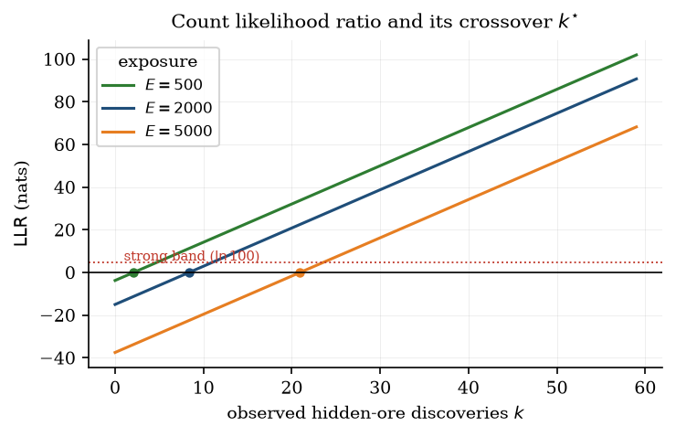
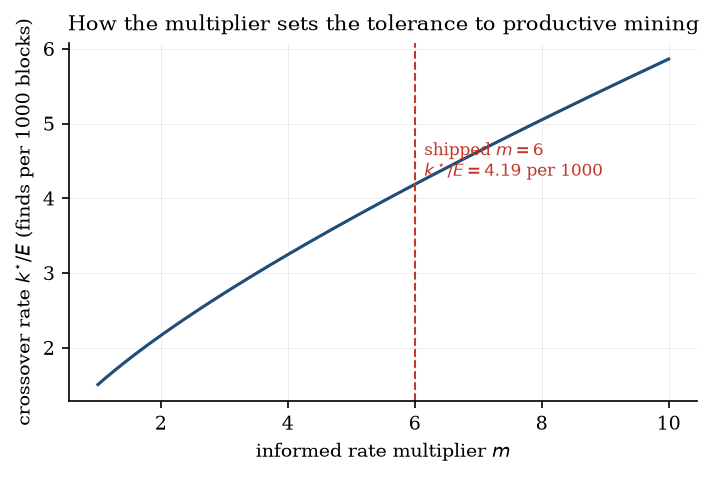
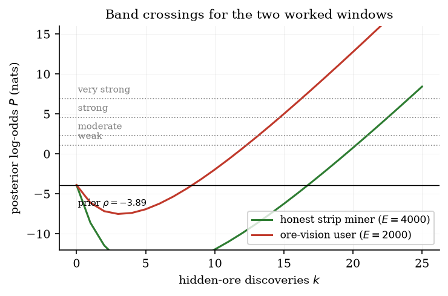

# Exposure-normalised likelihood ratios for the detection of ore-vision cheating in voxel-world server telemetry

**Ambercode**

*Technical Report XRAY-TR-1, revision 1.0.1*

---

## Abstract

Ore-vision cheating, in which a player obtains knowledge of ore positions they could not have
acquired through play, is difficult to detect because the behaviour it produces is not
kinematically impossible. The cheater walks, mines and fights within the rules; only the
*information* they act upon is illicit. Anti-cheat systems that respond to this by counting ore
per unit time, or by flagging straight tunnels, conflate a lucky player with an informed one and
produce accusations that cannot be defended to the accused. We describe a detection framework
that reframes the problem as a two-hypothesis likelihood-ratio test evaluated against measurable
exposure, and we report the software-verification programme built around it.

The framework makes five design commitments. Exposure is measured in blocks of rock removed
rather than in elapsed time, which removes mining speed, tool quality and idle periods as
confounders. Evidence is accumulated in natural-log-odds space from five component signals
organised into four independent groups, with an explicit penalty term that grows with exposure so
that a large amount of mining with a proportionate number of finds is not treated as suspicious.
Small samples are contracted toward the null by a factor $n/(n+\kappa)$. Where a baseline can be
derived rather than tuned, it is derived: the probability that an aimless line of sight falls
inside a cone of half-angle $30^\circ$ is the exact solid-angle fraction $(1-\cos\theta)/2 =
0.0669873$, not a fitted constant. Finally, the decision layer requires both an evidence band and
a statistical-confidence floor before any irreversible action, and a missing measurement is
excluded from the likelihood rather than credited to the player.

We evaluate the framework in three ways that the available data permit: analytically, through two
fully worked windows that differ only in behaviour and that the model separates by 50.5 nats of posterior log-odds; behaviourally, through a suite of 177 automated tests in which synthetic
players conduct themselves as cave explorers, strip miners, branch miners and informed
ore-seekers, and the suite is written as a specification of the decisions those players must
receive; and adversarially, through a case study in which a naive vein-level rule produced
strongly incriminating evidence, a likelihood ratio of $0.997$, against a legitimate player, and
in which correcting the aggregation rule reduced the same evidence to $1.6\times10^{-11}$. We are
explicit that no field trial has been conducted, that no labelled ground truth exists, and that
the system publishes no false-positive rate, because none can be estimated without such data.
The report also develops the visibility geometry as an explicit physical model, in which the chance alignment baseline is an exact view factor and occlusion is Beer-Lambert attenuation with an extinction coefficient fixed by the porosity of the rock, and it presents thirteen figures that display the model's behaviour rather than new measurements. The contribution is a defensible statistical construction and an honest account of its limits.

**Keywords:** likelihood ratio, log-odds, forensic evidence evaluation, sequential detection,
ore-vision cheating, exposure normalisation, epistemic restraint

---

## 1. Introduction

A player excavating a Minecraft world removes blocks and, in doing so, occasionally exposes ore.
Ore is generated by the world generator according to rules that the server knows exactly and that
the player knows approximately. Cheating of the ore-vision family, which includes client
modifications that render ore through solid rock and side-channel tools that report nearby ore
coordinates, supplies the player with the generator's output directly. The player then mines
toward ore that they can see but the server does not believe they can see, and the result is
indistinguishable from ordinary play at the level of individual actions. The block break is legal,
the movement is legal, the inventory change is legal.

The detection problem therefore is not one of impossibility detection, which is how aimbots and
fly hacks are usually caught, but one of inference from behaviour to information. That distinction
determines the entire shape of a workable solution. A detector cannot point at an event and say
that the event could not have happened; it can only accumulate a body of observations and state
how much more probable that body is under the hypothesis that the player was informed than under
the hypothesis that they were not. This is the classical likelihood-ratio formulation used in
forensic science to weigh evidence, and it carries with it an obligation that event-based
detectors do not have: the ratio must be interpreted, not merely compared against a threshold,
and the practitioner must be able to see what the number rests on.

Systems that ignore this framing fail in two characteristic ways. The first is the rate counter,
which flags a player for finding too much ore per hour. Rate counters are defeated by mining more
slowly, by playing with worse tools, or by idling, and they are also triggered by a player who
happens to be working a rich seam. The second is the shape heuristic, which flags straight
tunnels, on the theory that a cheater mines efficiently toward ore. Shape heuristics are defeated
by mining inefficiently, and they are triggered by every competent strip miner, a group that
includes a substantial and vocal fraction of any survival server's population. Both approaches
share the deeper fault that a single sufficient statistic is asked to carry a claim that is
inherently multivariate.

The framework described here was designed for a server-side plugin, and its constraints are those
of that setting. It must run on a live server without perturbing tick timing. It must survive
restarts, because a player's conduct accumulates across sessions and a detector that forgets
every night is trivially defeated by playing in short bursts. It must not require labelled
training data, which no server operator has. And it must be conservative in a specific direction,
because the cost of a false accusation to a community exceeds the cost of a missed detector, and
because an operator who is handed an unexplainable score will either ignore the tool or misuse it.

### 1.1 Contributions

The contribution of this work is a construction rather than a discovery. We present a
likelihood-ratio model for ore-vision detection in which the exposure measure is blocks removed
rather than time, in which five signals are combined in log-odds space under an explicit
independence-group structure, in which a principled geometric baseline replaces a tuned constant
for one class of evidence, and in which the decision layer separates the strength of evidence from
the adequacy of the measurement. We accompany the construction with two worked windows that show
its behaviour on realistic quantities, with a software-verification programme that encodes
expected decisions as executable assertions, and with a documented case in which an apparently
reasonable vein-level rule generated spurious evidence and was corrected.

We also report a negative result of some value. It is not possible, with the data a server
operator actually holds, to estimate the false-positive rate of a detector of this kind. We
therefore decline to publish one, and we describe instead the mechanisms by which the design
raises the cost of a false accusation and the specific places where multiplicity across
evaluations remains unaddressed.

---

## 2. Related work

The statistical machinery used here is standard and old. The likelihood-ratio test for two simple
hypotheses is due to Neyman and Pearson [1]; its use as a measure of the weight of evidence, and
the logarithmic scale that makes independent contributions additive, is due to Good [2] and was
given its now-conventional verbal bands by Jeffreys [3]. Forensic science has adopted this scale
formally; the ENFSI guideline for evaluative reporting [4] recommends exactly the vocabulary of
weak, moderate, strong and very strong that we adopt, on the grounds that an established scale
allows a practitioner's intuition to transfer between domains and, more importantly, keeps the
quantity unambiguously a strength of evidence rather than a claimed frequency of offenders.
Kass and Raftery [5] survey the interpretation of Bayes factors and the reasons such ratios are
routinely misread as error rates. The clustering of the model around a Poisson process, and the
handling of intervals that are known only to exceed a bound, follow the standard theory of point
processes and censoring [6]. The multiple-comparison problem, which we discuss but do not solve,
is the subject of the familiar literature on family-wise error and false discovery [7], and the
broader concern that a search across many analyses produces findings that do not replicate is set
out by Ioannidis [8]. The eigen-decomposition used to characterise tunnel shape is the classical
principal component analysis [9], computed by the cyclic Jacobi method [10], which remains an
attractive choice for fixed small symmetric matrices.

The application domain has a literature of its own, but it is largely non-statistical. Server-side
anti-cheat for voxel games is dominated by movement analysis, which is tractable because the
server is authoritative about position and can reject physically impossible trajectories outright.
Ore-vision detection has no such authority and consequently attracts heuristics of the kind
described in Section 1. To our knowledge the problem has not previously been formulated as a
likelihood-ratio test against an exposure normalisation, and no published system separates the
strength of its evidence from the adequacy of the sample behind it. The second separation is, in
our view, the more useful of the two in practice.

---

## 3. Problem formulation

### 3.1 Observables

The server observes, and the framework consumes, five quantities that are either recorded
directly or reconstructed from stored state. Movement and orientation, sampled as a path of
positions and view vectors. Block removals, each carrying the position, the block type, the time
and the actor, which allows the removal of a block by a player other than the one under analysis
to be distinguished and accounted for. The state of the world at the moment an ore is uncovered,
which determines whether that ore was visible from somewhere the player could legitimately have
stood. The identity and geometry of the connected vein to which a discovered block belongs. And
the stored history of the player's earlier discoveries, which is what makes the construction
survive a restart.

From these, each ore discovery is classified into an exposure state. Fully exposed ore is visible
from ordinary play. Partially exposed ore is visible from some positions but not the one occupied.
Conditionally exposed ore was reached through a tunnel that predates the player's own excavation,
so its visibility is attributable to whoever dug that tunnel. Hidden ore was not visible from any
position the player could have occupied. The classification is conservative in a specific sense
that matters: the analyser walks sample points between block centres rather than performing the
engine's own raycast, and consequently its errors are of the kind that downgrade a hidden verdict
to a more visible one. The approximation can therefore only make the system more lenient toward
the player, never less, and this asymmetry is deliberate rather than incidental.

### 3.2 Hypotheses

We consider two hypotheses about a single player, in a single world, over a single analysis
window.

Under $H_0$, the player is mining legitimately. They discover hidden ore at the rate that an
honest miner would, given the terrain and the quantity of rock moved. Their direction of travel
and their camera aim are governed by ordinary exploration, not by knowledge of ore positions.
Their mix of hidden and exposed discoveries matches the distribution that the world generator and
ordinary play produce.

Under $H_1$, the player has access to information about ore positions that they could not have
obtained by play. This elevates the rate at which they find hidden ore per block moved, biases
their arriving heading and their aim toward ore they cannot yet see, and skews their discovery mix
toward hidden ore. It does not, and this is important, predict any particular tunnel shape.
Ore-seeking through rock and efficient strip mining both produce long straight galleries, and a
model that treated straightness as evidence of ore-vision would convict the strip miner.

The narrowness of $H_1$ is a deliberate restriction. The framework is a test for ore-directed
cheating and nothing else. A player using flight, or reach, or an aimbot, is not modelled and will
not raise the score. Stating this plainly is not a limitation of the method so much as a
description of its scope, and it prevents the common failure in which a composite "suspicion"
score is assembled from unrelated signals and can no longer be explained to anybody.

### 3.3 Design constraints

Four constraints shaped the construction. The detector must be cheap enough to run on the server's
own analysis threads without affecting tick timing, which excludes any approach requiring
per-tick inference over a large state space. It must function in the absence of labelled data,
which excludes supervised learning and excludes any calibration of thresholds against known
cheaters. It must persist its conclusions across restarts while remaining recomputable, so that an
old verdict can be revisited rather than merely trusted. And it must fail toward leniency under
uncertainty, so that missing information yields a non-informative contribution rather than a
crude inference in either direction.

---

## 4. The evidence model

Throughout, evidence is accumulated in natural-log-odds space. A contribution $\mathrm{LLR} =
\ln[P(\text{data}\mid H_1)/P(\text{data}\mid H_0)]$ is positive when the observation favours
informed mining, negative when it favours legitimate mining, and zero when it is uninformative.
Additivity of log-odds under independence is what makes a multi-signal construction tractable, and
the grouping structure of Section 4.5 exists because that independence is an assumption the
designer must actively defend rather than assume.

### 4.1 Exposure as the normalising quantity

The rate component divides a count of hidden discoveries by an exposure measure. The choice of
that measure is the single most consequential modelling decision in the framework, and we take it
to be $E$, the number of blocks the player removed in the window, rather than elapsed time.

The reason is confounding. Wall-clock time is entangled with mining speed, and mining speed
depends on tool enchants, on haste effects, on server lag, on whether the player paused to build,
and on how long they were logged in. A player with an efficiency-five pickaxe removes several
times as many blocks per hour as a player without one, and a rate expressed per hour therefore
compares strategies rather than conduct. Blocks removed is a property of the terrain and of the
player's excavation strategy, and it is comparable across players whose tooling and session length
differ. Time enters the model only as decay, never as the measure of effort.

A second consequence of using exposure is that the likelihood ratio acquires a penalty term that
grows with the amount of mining performed. This is the mechanism that prevents a productive and
honest player from being flagged merely for having mined a great deal, and we develop it in the
next section.

### 4.2 Count model

We model the number of hidden-ore discoveries $K$ over exposure $E$ as Poisson, with rate
$\lambda_0$ per block under $H_0$ and $\lambda_1 = m\lambda_0$ under $H_1$, where $m$ is an
ore-specific multiplier. Writing the log mass function $\ln p(k;\lambda E) = k\ln(\lambda E) -
\lambda E - \ln k!$ and subtracting the $H_0$ term from the $H_1$ term, the factorial term
cancels because both hypotheses share the observation space, and one obtains

$$\mathrm{LLR} = k \ln\frac{\lambda_1}{\lambda_0} - (\lambda_1 - \lambda_0)E.$$

The second term does not depend on the observed count and grows linearly in exposure. It is a
penalty on having mined a lot of rock without a corresponding number of finds, and it is what
distinguishes this model from a rate counter. The likelihood ratio passes through zero at

$$k^{\star} = E\,\frac{\lambda_1-\lambda_0}{\ln(\lambda_1/\lambda_0)},$$

that is, at a rate of $(\lambda_1-\lambda_0)/\ln(\lambda_1/\lambda_0)$ per block. With the shipped
diamond prior $\lambda_0 = 1.5\times10^{-3}$ per block and multiplier $m=6$, the crossover lies at
$0.0075/1.7918 = 4.19\times10^{-3}$ per block, or $4.19$ finds per thousand blocks mined. This is
approximately $2.79$ times the legitimate prior. A player must therefore exceed the prior rate by
a factor of nearly three before any positive evidence accrues at all, and the design of the prior
and the multiplier is where that margin is set.

The component returns a non-informative contribution, rather than a large negative one, when no
hidden discoveries were recorded. A zero count against a positive expectation would otherwise
produce a substantial exculpatory term, and crediting a player for not having been observed yet
would be a mistake of a kind that compounds: the more thorough the surveillance, the more
exculpation it would manufacture.

### 4.3 Binary models

Two signals are genuinely binary and use a binomial likelihood ratio. For $k$ successes in $n$
independent trials, the binomial coefficient cancels between hypotheses and

$$\mathrm{LLR} = k\ln\frac{p_1}{p_0} + (n-k)\ln\frac{1-p_1}{1-p_0}.$$

The first application is the exposure mix. Of $n$ classified discoveries, $k$ were buried, with
$p_0 = 0.55$ and $p_1 = 0.95$ as the legitimate and informed hidden fractions. The second
application is targeting, in which each buried vein with a measurable approach contributes one
Bernoulli trial per signal, one for whether the arriving movement direction lay within
$30^\circ$ of the ore and one for whether the view direction did.

The independence of trials is an assumption the caller must uphold, and it is easy to violate. The
veins of a world are placed by a generator that clusters ore, so the blocks within one vein are
strongly correlated in position and in exposure. Counting trials per block would be
pseudo-replication, inflating the apparent sample size by a factor of the mean vein size while
contributing no new information. The framework therefore counts one opportunity per vein, never
per block, and the sample-size accounting of Section 4.6 depends on that rule.

### 4.4 Waiting times and censoring

If discoveries arrive as a Poisson process, the intervals between them are exponential, and this
model consequently shares its assumptions with Section 4.2 rather than providing an independent
check. For an observed interval $x$ the log density is $\ln r - rx$, and for an interval known
only to exceed $x$, because the window ended first, the contribution is the log survival function
$-rx$. Summing over $n_{\text{obs}}$ observed intervals and any censored ones,

$$\mathrm{LLR} = n_{\text{obs}}\ln\frac{r_1}{r_0} - (r_1-r_0)T, \qquad T = \sum_{\text{obs}}x +
\sum_{\text{cens}}x,$$

which is algebraically the same linear form as the count model with $k = n_{\text{obs}}$ and
$E=T$. The two are therefore not independent evidence, and Section 4.5 groups them accordingly.

The treatment of the final interval deserves comment because it is a case where an intuitive
implementation is biased. The last interval, running from the final discovery to the end of the
window, is the effort during which nothing was found. Discarding it, as an implementation focused
on inter-discovery times might naturally do, would leave only the productive intervals in the sum
and so would shorten the observed mean wait. A shorter mean wait reads as a higher discovery rate,
which is evidence for $H_1$. Omitting the trailing interval would therefore manufacture suspicion,
and the framework appends it explicitly as a right-censored observation. Where a window contains
no discoveries at all, its entire effort becomes a single censored observation.

### 4.5 Independence groups

Five components contribute, and they are organised into four groups. The discovery-rate group
contains the count model and the waiting-time model, which Section 4.4 showed to be near-redundant
in the simple case. The targeting group contains the alignment signals. The exposure-mix group
contains the buried-fraction signal. The geometry group contains the tunnel-shape contribution.

Within a group, weighted contributions are summed; across groups, the group sums are summed. This
is a coarser instrument than a full covariance model and we do not claim otherwise. Its purpose is
to prevent the same underlying event from being counted twice under two names, which is the most
common way a multi-signal detector silently inflates its own confidence. The grouping is asserted
by the components and not estimated from data, and the assumption that the four groups are
themselves independent is not verified.

### 4.6 Weighting, contraction and decay

Each component reports a likelihood ratio together with a sample size and a reliability
$r_i \in [0,1]$ expressing the model's intrinsic trust in that signal. The shipped reliabilities
are $0.8$ for the count model, $0.7$ for waiting time, $0.75$ for targeting, $0.6$ for the
exposure mix and $0.4$ for geometry. The weighted contribution is $w_i = r_i\,\mathrm{LLR}_i$, and
contributions with zero sample, zero reliability or zero ratio are excluded rather than summed as
zero.

The raw total $R = \sum_g \sum_{i \in g} w_i$ is then contracted toward the null by a single
scalar

$$s(n) = \frac{n}{n+\kappa}, \qquad \kappa = 5,$$

where $n$ is the sample size. The values are $s(1) = 0.167$, $s(5) = 0.5$, $s(10) = 0.667$ and
$s(50) = 0.909$. The intent is that a nominal likelihood ratio is the value a component would carry
if the model were exactly right and the sample large, and that with two observations it should not
be taken at face value. This is the mechanism that prevents three lucky finds from producing a
dramatic score, and it is deliberately not a significance correction: it carries no coverage
guarantee and is best understood as a regularising prior that the truth is near the null when data
are scarce.

One subtlety should be recorded rather than smoothed over. The contraction is applied once to the
whole sum and uses the maximum group sample size, so a large sample in one family partially
relaxes the contraction applied to the evidence of every other family. This is a simplification, and an
error-corrected estimator applied per group would be a different and arguably better model.

Decay is applied within the window as the mean exponential weight of its discoveries,

$$\phi = \frac{1}{|D|}\sum_{d\in D} e^{-\lambda\,\mathrm{age}(d)}, \qquad \lambda =
\frac{\ln 2}{t_{1/2}},$$

with half-life $t_{1/2} = 168$ hours, so $\lambda = 4.1259\times10^{-3}$ per hour and a
discovery one week old carries half its weight. The exponential form was chosen for
memorylessness, since the fraction of weight lost in the next hour then does not depend on how old
the observation already is, and because it is the natural conjugate of the Poisson process that
generated the discoveries. A hard cut-off was rejected because it would create a cliff at which a
score drops discontinuously, which is both surprising to an administrator and gameable by pausing
until the cut-off has passed. The evaluation time is passed explicitly rather than read from the
clock, so that replaying a stored window reproduces the historical verdict instead of silently
re-decaying it.

### 4.7 Posterior and reported score

The effective accumulation is $\Delta = R\,s(n)\,\phi$, the posterior log-odds are
$P = \mathrm{clamp}(\rho + \Delta, -30, 30)$ with prior $\rho = \ln(0.02/0.98) = -3.8918$, and
the reported suspicion score is the logistic transform $\pi = \sigma(P)$.

The clamp at magnitude thirty corresponds to a probability within $10^{-13}$ of certainty and lies
far beyond any decision threshold, so it never changes a verdict. It exists so that a long run of
evidence cannot overflow the exponential, and so that a single overwhelming observation cannot pin
the posterior at exactly one and thereby freeze the model against later contradicting evidence.
The probability transform is implemented in branch-stable form rather than as the naive logistic,
to avoid overflow for large negative arguments and cancellation for large positive ones.

### 4.8 Confidence

The framework reports, separately from the strength of the evidence, an index of how much
measurement stands behind it:

$$C(n,G) = \left(1-e^{-n/n_0}\right)\left(1-e^{-G/g_0}\right), \qquad n_0 = 20,\; g_0 = 2,$$

where $n$ is the sample size and $G$ the number of independent groups that contributed. The first
factor rises with the number of independent observations and saturates, reaching $0.632$ at
$n = 20$ and $0.950$ at $n = 60$. The second rises with the number of distinct signal families,
reaching $0.865$ at $G = 2$ and $0.982$ at $G = 4$. Their product encodes the principle that a
great deal of data from one family cannot substitute for corroboration from another: a hundred
observations in a single group yield $C = 0.007 \times 0.393 = 0.003$. Both factors approach
unity without reaching it, because residual uncertainty about a behavioural inference never
vanishes and a system reporting absolute certainty would be misrepresenting itself.

We stress that $C$ is a heuristic index and not a posterior probability or a coverage level. It
answers "how much have we looked", while $\pi$ answers "which way does what we have seen point".
Keeping them in separate fields is deliberate, because a high score with low confidence means
something an operator needs to be told: the behaviour is startling but the observation base is
thin.

### 4.9 Strength bands

Bands are defined on the posterior log-odds rather than on the suspicion percentage, because a
probability scale compresses precisely the region where the distinctions of interest live;
$0.99$ and $0.999$ are adjacent on a probability axis but an order of magnitude apart as evidence.
A probability also invites the reader to treat the number as a frequency, which it is not.

| Band | Condition | Nominal likelihood ratio |
| --- | --- | --- |
| very strong | $P \ge \ln 1000$ | $1000$ |
| strong | $P \ge \ln 100$ | $100$ |
| moderate | $P \ge \ln 10$ | $10$ |
| weak | $P \ge \ln 3$ | $3$ |
| insufficient | $P < \ln 3$, or gates unmet | not applicable |

The gates are a minimum sample size of ten and a minimum of two independent groups; if either is
unmet the verdict is insufficient regardless of how large $P$ becomes. The labels and thresholds
follow the verbal scale used in forensic practice [4], which we adopt so that a moderator's
intuition transfers from other domains and so that the quantity is unambiguously a strength of
evidence.

Two caveats belong here rather than in a footnote. First, the thresholds are compared against
$P = \rho + \Delta$, which includes the prior, so a band labelled by a likelihood ratio is
strictly a threshold on posterior odds; the weak band, for instance, requires
$\Delta \ge \ln 3 + 3.8918 = 4.990$. This is a deliberate simplification and not a normalisation
error, but it means the labels overstate the strength of the underlying ratio. Second, a Bayes
factor is not a p-value. A likelihood ratio of a thousand does not mean one false positive in a
thousand, and converting it into an error rate requires a prior and a loss function that this
construction does not specify. A player whose behaviour argues against $H_1$ produces strongly
negative $P$ and falls into the same insufficient branch, which is intended: labelling
exculpatory evidence as weak suspicion would read as a mild accusation in a moderation report.

### 4.10 Why the components take the forms they do

The expressions of Sections 4.2 to 4.8 are not conventional choices. Each answers a stated
requirement, and this section states the requirement and carries out the derivation, so that a
reader can disagree with a modelling decision at the point where it was made rather than having
to reverse-engineer it.

**Neyman-Pearson as the reason for using a ratio at all.** Among all tests of $H_0$ against $H_1$
whose probability of rejecting $H_0$ when $H_0$ is true does not exceed a fixed level, the test
that rejects for large values of the likelihood ratio is the most powerful [1]. Writing $\Lambda =
p(\mathrm{data}\mid H_1)/p(\mathrm{data}\mid H_0)$ and taking logarithms, which is monotone and
therefore preserves the ordering of evidence, every threshold on the strength of evidence becomes
a threshold on $\ln\Lambda$. The logarithm is also the unit in which independent contributions
add, which is what allows five signals to be combined by summation. This is the reason the
framework accumulates a log-likelihood ratio and not, say, a weighted sum of normalised scores: a
weighted sum of scores has no reading as a weight of evidence, and cannot be interpreted to an
accused player.

**The Poisson ratio.** Let the number of hidden-ore discoveries over exposure $E$ be Poisson with
mean $\lambda E$ under each hypothesis. Then the likelihood ratio is

$$ \frac{p(k\mid H_1)}{p(k\mid H_0)} = \frac{(\lambda_1 E)^k e^{-\lambda_1 E}/k!}{(\lambda_0 E)^k e^{-\lambda_0 E}/k!} $$

and the factor $k!$ appears in numerator and denominator because both hypotheses describe the same
observations over the same space, so it cancels. Taking logarithms leaves
$k\ln(\lambda_1/\lambda_0) - (\lambda_1-\lambda_0)E$, which is (4.2). The cancellation is not
cosmetic: it is why the count model needs no normalising constant, and it is the same cancellation
that makes the waiting-time model of Section 4.4 algebraically identical to it.

**Why exposure and not time, in one line.** Under $H_0$ the expected count is $\lambda_0 E$. If
$E$ were replaced by elapsed time $t$, the parameter being tested would become the discovery rate
per hour, which is a function of tooling, haste effects and server lag as much as of conduct. The
crossover $k^{\star} = E(\lambda_1-\lambda_0)/\ln(\lambda_1/\lambda_0)$ then grows with exposure
rather than being fixed, which is the formal statement of the claim in Section 4.1 that sheer
productivity is not evidence.

**Contraction as a conjugate posterior weight.** The factor $s(n) = n/(n+\kappa)$ is usually
introduced as a smoothing heuristic. It has a derivation. Let the unknown per-block rate be
$\lambda$ with a Gamma prior $\lambda \sim \mathrm{Gamma}(\alpha, \beta)$ of mean $\alpha/\beta$.
After observing $k$ discoveries over exposure $E$ the posterior is
$\mathrm{Gamma}(\alpha + k, \beta + E)$ with mean

$$ \mathbb{E}[\lambda \mid k, E] = \frac{\alpha+k}{\beta+E} = \frac{\beta}{\beta+E}\cdot\frac{\alpha}{\beta} + \frac{E}{\beta+E}\cdot\frac{k}{E}, $$

so the data estimate $k/E$ receives weight $E/(\beta+E)$ and the prior mean receives the rest. The
shipped form is the same object written in sample size rather than exposure, with $\kappa$ standing
for the number of pseudo-observations that the prior is worth: at $n = 5$ observations the data
receive half the weight, and at $n = 50$ they receive $0.909$. The choice $\kappa = 5$ is therefore
a statement that the prior is worth about five observations, not an arbitrary constant. One honest
qualification belongs here: the derivation justifies the functional form, and the implementation
then applies it multiplicatively to a log-ratio rather than to a rate estimate, which is a
modelling decision rather than a consequence of the derivation.

**Why the decay must be exponential.** Require of any forgetting scheme that the weight of an
observation factorise across disjoint time intervals, $w(t+s) = w(t)w(s)$, which is the statement
that the scheme has no memory of how old an observation already is. The continuous solutions of
this functional equation are exactly $w(t) = e^{-\lambda t}$. The exponential is therefore not one
option among several but the only memoryless weighting, and the half-life is a reparametrisation
of it, $\lambda = \ln 2 / t_{1/2}$. A hard cut-off fails the requirement, since it introduces a
discontinuity at which the weight drops to zero, and a power law fails it too, which is the formal
content of the remark in Section 4.6.

**Confidence as an arrival probability.** Model the arrival of a decisive amount of evidence as a
Poisson process of rate $1/n_0$. The probability that at least one such arrival has occurred by
sample $n$ is $1 - e^{-n/n_0}$, which is also the cumulative distribution of an exponential
variable of mean $n_0$. With $n_0 = 20$ the index reaches $0.632$ at twenty observations and
$0.950$ at sixty. Multiplying the analogous factor in the number of independent groups treats the
two requirements as independent necessary conditions, each of which must be met. The product can
be inverted for the sample size a decision requires: the smallest $n$ for which $C(n, 4) \ge 0.75$
is $n = 41$, which is the figure quoted in Section 7.2 and is obtained by solving
$1 - e^{-n/20} = 0.75/(1-e^{-1}) = 0.86739$.

**Posterior odds.** Bayes' theorem gives posterior odds equal to prior odds times the Bayes factor,
so in logarithms $P = \rho + \Delta$ with $\rho = \ln(0.02/0.98) = -3.8918$. The prior encodes a
base rate of two per cent, that is, the belief that any given evaluated player is cheating before
any of their behaviour has been examined. It is the only place a server's own population enters
the calculation, and it is why the bands of Section 4.9 overshoot: they are thresholds on $P$,
which includes $\rho$, rather than thresholds on $\Delta$.

---

## 5. Geometry

Geometry never decides a verdict in this framework. It exists to modulate other evidence, since a
suspicious discovery rate achieved along a suspiciously efficient path is more informative than
the same rate achieved while wandering, and to help a moderator read the numbers. The section is
placed separately because the two geometric quantities that enter the model are derived rather
than fitted, and the third is capped precisely because it is the classic source of false positives.

### 5.1 The physical model of ore visibility

The framework's treatment of visibility is a model of the same kind as those used for radiation
transport, and setting it out as such makes its assumptions explicit and shows which of its
constants are derived rather than chosen. We consider an observer at a point $\mathbf{o}$ and an
ore block treated as a small planar target of radius $a$ at distance $r$, and ask for the
probability that an arbitrarily directed line of sight from the observer reaches the target.

The purely geometric part of the answer is the view factor, the fraction of the observer's
directions that fall on the target. For a target subtending solid angle $\Omega$, the fraction of
the full sphere is $\Omega/4\pi$, and for a disc of radius $a$ viewed from distance $r$ the
half-angle satisfies $\cos\theta = r/\sqrt{r^2+a^2}$, so that

$$ F_{\mathrm{geom}}(r, a) = \frac{1}{2}\left(1 - \frac{r}{\sqrt{r^2+a^2}}\right). $$

For a target large enough that $\theta$ is set by a fixed acceptance angle rather than by its own
size, this reduces to the expression already derived in Section 5.2, $(1-\cos\theta)/2$, which at
$\theta = 30^\circ$ is $0.0669873$. Two consequences follow immediately. The geometric factor
decays only slowly with distance, since for $r \gg a$ it goes as $a^2/4r^2$. And it is a fraction
of the sphere rather than of the hemisphere because the observer's aim is one direction among all
directions, which is why the constant is divided by two.

The second part is attenuation, and this is where the model departs from vacuum optics. Rock is a
porous medium for this purpose: a ray travelling through it is blocked if it meets an opaque voxel.
If a fraction $p$ of the voxels are opaque and the ray traverses $L$ voxels, and if occlusion by
successive voxels is treated as independent, the probability of reaching the far side is

$$ P_{\mathrm{transmit}}(L) = (1-p)^{L} = e^{L \ln(1-p)} = e^{-\mu L}, \qquad \mu = -\ln(1-p), $$

which is Beer-Lambert attenuation with an extinction coefficient fixed by the porosity of the
medium. With unit voxels, $L = r$, so the coefficient is per block. The correspondence is not a
loose analogy; it is the identical algebra, and it is the reason the framework describes occlusion
by a single number. For $p = 0.15$ the coefficient is $\mu = 0.163$ per block and half the rays are
lost within $4.27$ blocks, which is the quantitative content of the statement that a veil of rock
hides ore extremely effectively at close range.

Combining the two factors gives the detection probability for a target at distance $r$,

$$ D(r) = \frac{1-\cos\theta}{2}\, e^{-\mu r}, $$

whose maximum is the geometric fraction and which falls to zero as the target recedes. The number
of ore blocks a player can actually see from a viewpoint is then the sum of $D$ over the vein's
blocks, each with its own distance and its own occlusion path,

$$ N_{\mathrm{vis}}(\mathbf{o}) = \sum_{i} \frac{1-\cos\theta_i}{2}\, e^{-\mu r_i}, $$

and the classification of Section 3.1 is the question of whether a candidate position
$\mathbf{o}$ exists for which this sum is non-zero, with the exposure states corresponding to how
many of the vein's blocks contribute.

Three things about the model should be stated plainly rather than left to be inferred. First, the
independence of voxel occlusion used in the derivation is an approximation: real rock is
correlated, a single stone slab can block many rays at once, and the effective $\mu$ therefore
varies with the structure of the terrain rather than being a property of the medium alone. Second,
the implementation does not evaluate the integral or solve for a position. It samples candidate
positions and casts rays, which is cheap enough to run on the analysis thread and which, as
Section 3.1 notes, errs only in the direction of calling an occluded block visible, that is, in the
player's favour. Third, nothing downstream depends on $\mu$: the physics fixes the shape of the
model and the exact value of the geometric baseline, while the operational decisions rest on the
count statistics of Sections 4.2 to 4.7. The physical model is therefore explanatory, and the one
constant it contributes to a decision is the $0.0669873$ that a line of sight lands on the target
by chance.

### 5.2 An exact baseline for look alignment

The targeting component asks whether the player's line of sight already pointed at an ore before
it could have been visible. To weigh a positive answer, one needs the probability that an aimless
line of sight would have landed in the same cone by chance. That probability is a geometric
quantity and not a modelling choice. A cone of half-angle $\theta$ subtends solid angle

$$\Omega(\theta) = \int_0^{2\pi}\!\!\int_0^{\theta}\sin\theta'\,d\theta'\,d\varphi = 2\pi(1-\cos\theta),$$

and the unit sphere has solid angle $4\pi$, so the fraction of all directions falling inside the
cone is

$$P_{\text{cone}}(\theta) = \frac{1-\cos\theta}{2}.$$

At $\theta = 30^\circ$ this is $(1 - 0.8660254)/2 = 0.0669873$. The value used as the legitimate
look-alignment probability is therefore not a tuned constant but the exact answer to a geometric
question, and this is the one place in the framework where a baseline can be defended from first
principles rather than from judgement. The informed counterpart is set at $0.5$, which is a
modelling choice and not a derivation, giving a per-aligned-look ratio of $0.5/0.067 = 7.46$ and a
per-missed-look ratio of $0.5/0.933 = 0.536$.

Movement alignment is treated more weakly, and the reason is worth stating because it is a direct
consequence of the false-positive analysis. A strip miner excavates whatever lies ahead, so the
ore they uncover is very frequently directly in front of them; movement alignment is therefore
nearly uninformative for that population. The shipped probabilities are $p_0 = 0.5$ and
$p_1 = 0.8$, so an aligned movement direction contributes only $\ln 1.6$. The weaker model costs
sensitivity against a cheater who mines in arbitrary directions and is retained because the
alternative is a detector that flags competent strip miners.

A measurement detail is included because it is easy to get wrong. The approach heading is sampled
at the last path point at least eight blocks from the ore, not at the moment of arrival. At
arrival every player is adjacent to the ore and the angle is meaningless, since the direction to a
block one is standing next to carries no information. The angle itself is computed as
$\operatorname{atan2}(|\mathbf{u}\times\mathbf{v}|, \mathbf{u}\cdot\mathbf{v})$ rather than by an
inverse cosine, because the cross-product form is well-conditioned for nearly parallel vectors
where $\arccos$ loses precision.

### 5.3 Principal axes of a point cloud

A mined gallery or a vein is represented as a cloud of block centres. With mean
$\boldsymbol{\mu} = N^{-1}\sum_j \mathbf{p}_j$, the covariance matrix in its maximum-likelihood
form is

$$\mathbf{C} = \frac{1}{N}\sum_{j=1}^{N}(\mathbf{p}_j-\boldsymbol{\mu})(\mathbf{p}_j-\boldsymbol{\mu})^{\!\top},$$

a symmetric $3\times3$ matrix whose eigendecomposition $\mathbf{C} = \mathbf{V}\boldsymbol{\Lambda}\mathbf{V}^{\!\top}$
yields orthonormal axes and eigenvalues $\ell_1 \ge \ell_2 \ge \ell_3$, sorted so that the first
axis is always the dominant direction. The derived shape descriptors are

$$\text{straightness} = \frac{\ell_1}{\ell_1+\ell_2+\ell_3}, \qquad
\text{linearity} = \frac{\ell_1-\ell_2}{\ell_1}, \qquad
\text{planarity} = \frac{\ell_2-\ell_3}{\ell_1}.$$

Straightness approaches unity for a one-dimensional cloud and one third for an isotropic one;
linearity is the standard dimensionality descriptor and is near unity for a clean line. Because
only ratios of eigenvalues enter these expressions, the choice between the maximum-likelihood and
unbiased normalisations is immaterial to any decision.

The decomposition is performed by the cyclic Jacobi method rather than by a general linear algebra
library. For a fixed symmetric $3\times3$ matrix, Jacobi converges quadratically and terminates in
a small number of sweeps, requires no pivoting heuristic, and is numerically stable because it
applies only orthogonal similarity transformations, which preserve symmetry and cannot amplify
error. Each step chooses the rotation that annihilates one off-diagonal entry $(p,q)$ through

$$\tau = \frac{a_{qq}-a_{pp}}{2a_{pq}}, \qquad
t = \frac{\operatorname{sgn}\tau}{|\tau|+\sqrt{\tau^2+1}}, \qquad
c = \frac{1}{\sqrt{t^2+1}}, \qquad s = tc,$$

taking the smaller-magnitude root so that cancellation does not occur when $\tau$ is large. Sweeps
continue until the off-diagonal magnitude falls below $10^{-12}$ or fifty sweeps have been
performed. Eigenvectors are determined only up to sign, and callers that need an oriented
direction re-derive it by projection.

### 5.4 Path efficiency and the capped contribution

Two directness measures are computed from the path. Path efficiency is net displacement divided
by accumulated path length,

$$\text{efficiency} = \mathrm{clamp}\!\left(\frac{\|\mathbf{p}_N-\mathbf{p}_1\|}{\sum_i \|\mathbf{p}_i-\mathbf{p}_{i-1}\|}, 0, 1\right),$$

which is near unity for a straight transit and near zero for wandering or backtracking. Turning
behaviour is summarised by the angle between successive segments, with a change of $30^\circ$ or
more counting as a turn, and turn density expressed as turns per hundred blocks so that the
measure does not scale with session length.

The geometry component combines straightness and efficiency into a composite
$L = 0.5\,\text{straightness} + 0.5\,\text{efficiency}$, on the grounds that a path can be straight
without being efficient, as when a player walks straight, pauses and walks straight again, and
efficient without being globally straight. Its contribution is

$$\mathrm{LLR}_{\text{geo}} = \mathrm{clamp}\big(1.2(L - 0.75),\, -\ln 2,\, +\ln 2\big),$$

with a neutral linearity of $0.75$. The contribution therefore never exceeds a likelihood ratio of
two in either direction, and with a declared reliability of $0.4$ its maximum effect on the
accumulated sum is $0.4\ln 2 = 0.277$ nat. Its sample size is fixed at one per window, whatever
the number of vertices in the path, because treating the vertices as independent observations
would allow this weakest of signals to dominate the sample-size accounting and, through the
contraction factor and the confidence index, to inflate confidence in every other component.

The cap is the substantive point. Tunnel geometry is the archetypal false-positive generator in
this problem, because strip mining and ore-seeking produce similar galleries while branch mining
and systematic cheating produce similar grids. A model that treated shape as decisive would be
unusable, and the framework therefore admits geometry only as a small perturbation on a
construction that rests on the discovery statistics.

---

## 6. Implementation

### 6.1 A platform-neutral analytical core

The system is built as a multi-module project in which the statistical engine has no dependency of
any kind on the game server. The core module contains the domain model, the geometry, the
statistical primitives and the five components, and is tested in isolation against synthetic
observations. A second module implements persistence against the repository interfaces declared in
the core. A third contains the administration interface discussed in Section 6.5. Only the fourth
module, the server adapter, refers to the server's own types, and it is the only place where an
event is translated into an observation and a decision into an action.

The separation is not architectural decoration. It is what makes the statistical model testable
without a running server, and it is what allowed the entire adapter layer to be retargeted from
one server API to another during development without touching a line of the analysis. It also
constrains the vocabulary of the core: no game type appears in it, and consequently no component
can accidentally depend on a detail of the world representation that a different server would
express differently.

### 6.2 Threading

Collection is event-driven and runs on the server's own thread, where it must be cheap. Everything
else, including all statistical evaluation and every database operation, runs on worker threads.
This is a correctness requirement rather than an optimisation: a database round trip on the server
thread is a tick stall visible to every player, and an operator who observes one will remove the
plugin. The decision layer likewise never performs I/O, receiving already-computed assessments.

### 6.3 Continuity across restarts

A detector that forgets its evidence at each restart is defeated by any player willing to log out
periodically, and an evidence window of a few hours is not a meaningful account of conduct. The
framework therefore hydrates the analysis window from stored observations before evaluating it,
selecting stored discoveries and mining events within a configurable lookback, which defaults to
ninety days, and merging them with the live session. The hydrated window is cached per player and
world with a time-to-live so that repeated evaluation does not re-query storage, and the load runs
on the analysis worker rather than on the server thread.

Retention for the underlying mining events was raised to thirty days so that the stored trajectory
reaches as far back as the lookback, and the configuration loader warns when the two settings
disagree, because a retention shorter than the lookback silently truncates the geometry signal
rather than failing visibly.

One asymmetry is introduced by the merge and is worth recording. The interval spanning the seam
between stored history and the live session has an unknowable length, since the server may have
been down or the player may have played unrecorded, so that single observation is discarded rather
than estimated. Discarding it removes effort from the denominator of the waiting-time likelihood
and is therefore always in the lenient direction. Every interval wholly inside the stored history
or wholly inside the live session is intact, so the effect is confined to the boundary.

### 6.4 Storage and reproducibility

Observations and assessments are persisted through repository interfaces, with the dialect chosen
at configuration time from an embedded single-file database by default and from a network database
for deployments in which several servers share a record. Because a stored window carries its own
discoveries and their timestamps, and because the evaluation time is passed explicitly rather than
read from the clock, an assessment can be recomputed from storage and will reproduce the verdict
it originally produced. That property is what permits a moderation decision to be audited months
later, and it is the reason the model resists the temptation to consult the current time.

### 6.5 Artifact engineering

Two constraints shaped the shipped artifact and are reported because they are unusual in detection
systems. First, the plugin must not require a second plugin or a bespoke installation, since an
operator who must install a database driver by hand will not. Second, the download must be small
enough that a server owner will try it. These pull against each other, because the database
connectivity the system needs is substantial: the embedded driver alone carries native binaries
for five platforms and accounted for $11.47$ MB of a $14.57$ MB artifact, for a plugin that runs
on one platform.

The resolution was to declare the libraries in the plugin descriptor and let the server resolve
them from a public repository at first start, caching them locally. Since the server performs the
resolution, the artifact carries none of them, and the model's own code is what remains. The
packaged artifact fell from $14{,}569{,}935$ bytes to $412{,}677$ bytes, a reduction of
$97.2$ per cent, of which the native libraries were the largest single term. The consequence is
that first start requires outbound network access, which is documented rather than hidden, and
that the artifact can be verified by pointing at itself: the packaged file is checked for its
declared libraries, for the absence of any bundled third-party class, for the bytecode level, and
for the presence of every configuration resource, and the check fails the build when a dependency
regains a scope that would silently re-embed it.

---

## 7. Evaluation

### 7.1 What can and cannot be established

A conventional evaluation of a detector reports its false-positive and false-negative rates on a
labelled corpus. No such corpus exists here and none can be assembled from the data a server
operator holds. Labelling requires either ground truth about which players cheated, which is
rarely known with confidence and never known completely, or an adjudication process whose errors
would be inherited by any measurement built on it. This is not a temporary state of affairs to be
remedied by collecting more data; it is a property of the domain. We therefore make no claim about
error rates anywhere in this work.

What can be established is narrower and still worth reporting. First, the arithmetic of the model
can be checked on realistic quantities, which we do in Section 7.2 with two fully worked windows
whose component contributions are shown explicitly. Second, the implementation can be shown to
produce the decisions its author intended for a set of behaviours whose correct treatment is not
in dispute, which is the substance of Section 7.3. Third, candidate mechanisms of false accusation
can be hunted and, when found, corrected, which Sections 7.4 and 7.5 report. Fourth, implementation
defects of the kind that make a model correct in theory and wrong in practice can be surfaced,
which Section 7.6 illustrates.

A conflict of interest should be named at the outset. The behavioural scenarios of Section 7.3
were authored by the same person who designed the model, so they test specification compliance
rather than predictive validity. Their value is that they are executable and permanent: a future
change that makes the engine treat a cave explorer as suspicious will fail the build rather than
be discovered on a live server.

### 7.2 Analytical case study: two windows

Two windows are constructed with the shipped defaults and evaluated by hand. Both describe an
overworld diamond miner; they differ only in behaviour. The first is a productive and honest
strip miner who removes $E = 4000$ blocks, finds $6$ hidden and $4$ exposed diamond deposits,
makes $5$ measurable approaches of which $2$ arrive with aligned movement and none with aligned
look, and whose composite path linearity is $L = 0.60$. The second is a moderate ore-vision user
who removes $E = 2000$ blocks, finds $16$ hidden and $2$ exposed deposits, makes $16$ measurable
approaches of which $11$ have aligned movement and $9$ aligned look, and whose path linearity is
$L = 0.89$.

| Component | Group | Honest window | Informed window |
| --- | --- | --- | --- |
| discovery rate | discovery-rate | $-19.249$ | $+13.668$ |
| waiting time | discovery-rate | $-19.249$ | $+13.668$ |
| exposure mix | exposure-mix | $-5.510$ | $+4.350$ |
| targeting | targeting | $-4.928$ | $+14.311$ |
| tunnel geometry | geometry | $-0.180$ | $+0.168$ |

Weighting by the component reliabilities and summing within groups gives raw totals of
$R = -35.948$ and $R = +33.913$. The sample sizes are ten and eighteen respectively, so the
contraction factors are $0.667$ and $0.783$, and the effective accumulations are
$\Delta = -23.965$ and $\Delta = +26.541$. Adding the prior of $-3.8918$ and clamping at magnitude
thirty leaves posteriors of $P = -27.857$ and $P = +22.649$, a separation of $50.5$ nats of
log-odds between two players whose behaviour differs only in the statistics of where they dug and
which way they were facing.

The verdicts are as instructive as the numbers. The honest window exceeds neither the weak
threshold nor, since $P$ is far below $\ln 3$, any band at all, and is reported as insufficient
despite meeting the sample and group gates; under the conservative decision policy it produces no
alert whatsoever. The informed window exceeds the very-strong threshold comfortably. Yet its
confidence index is $0.513$ and the confidence floor required for irreversible action is $0.75$,
so the decision layer returns a flag rather than a ban. Reaching the ban floor requires a sample
size of at least forty-one, which for this player would mean sustained conduct rather than a
single productive session.

That combination is the design working as intended, and it is the point of reporting the case
study rather than a receiver-operating-characteristic curve. The evidence arithmetic separates the
two behaviours decisively while the confidence index simultaneously refuses to claim more than the
observation base supports. An operator reading these two reports sees the difference between "this
argues strongly for cheating" and "we have enough here to act", which are different statements and
are frequently conflated.

### 7.3 Behavioural verification as a specification

The engine is exercised by 177 automated tests, of which 94 cover the analytical core, 13 the
persistence layer against a real embedded database, 57 the administration interface including 24
that drive a real HTTP server over a socket, and 13 the server adapter. The core tests are written
as claims about the decisions particular kinds of player must receive, rather than as assertions
about intermediate quantities. A cave explorer, a strip miner, a branch miner and a player who has
simply been lucky are each instantiated with synthetic observations, evaluated, and asserted to
receive a verdict no stronger than insufficient or weak. An ore-vision user is asserted to reach
at least strong. The advantage of asserting on decisions rather than on numbers is that the tests
survive legitimate retuning of constants while still failing if the qualitative behaviour inverts.

The suite also encodes several properties that are not obvious from the mathematics and that a
plausible reimplementation would violate. Uncertainty must not become leniency: a discovery whose
exposure cannot be determined is excluded from the mix, so that a world with pruned history
produces neither evidence nor exculpation, and the test asserts that neither happens. Another
player's tunnel must not be exculpatory, so ore classified as conditionally exposed because it was
reached through a pre-existing gallery is excluded from the buried count rather than counted as
visible. Sample size must be the maximum across signal families rather than their sum, which is
asserted because summing them is the natural and wrong implementation. And evidence must decay, so
that a window aged by several half-lives accumulates materially less than a fresh one containing
the same discoveries.

### 7.4 Adversarial case study: the partially visible vein

The most instructive experiment in this work concerns a rule that was reasonable, intuitive, and
wrong. Vein discovery is aggregated per vein rather than per block, as Section 4.3 requires, and
the aggregation rule originally judged a vein by the exposure state of the specific block that was
broken to uncover it. Under that rule, a player who uncovers a vein from the side breaks an
enclosed block first, and the vein is recorded as hidden even though the remainder of it was
plainly visible from the opening.

A synthetic scenario was constructed to measure the effect. Twenty veins were placed so that each
was open at one end, and a legitimate player mined them thoroughly. Under the per-block rule the
engine computed a suspicion score of $0.997$ and placed the player in the strong band, which is to
say it accused a player who had done nothing but tidy up ore they could see. Raising the vein
count to thirty pushed the verdict to very strong, since the evidence scaled with the number of
veins. The mechanism is instructive: mining the later blocks of a vein is *more* likely to expose
an enclosed face than mining the first, because the player's own excavation removes the surrounding
rock, so the per-block rule was systematically biased toward finding hidden ore in exactly the
population that mines veins completely.

The correction was to judge a vein by its most visible member, so that a vein is treated as
visible by ordinary play if any of its blocks was, and to record one observation per vein rather
than one per block. Under the corrected rule the same twenty-vein scenario yields a score of
$1.6\times10^{-11}$, that is, no evidence at all. The correction was made permanent by pinning the
scenario at twenty veins, and the choice of twenty is documented in the test because at ten veins
the sample-size gate already returns insufficient and the test would therefore have passed for the
wrong reason, masking the defect it exists to catch.

Two methodological observations follow. First, this defect would not have been found by reasoning
about the mathematics, because the mathematics was correct at the level of the per-block
observation; the error was in the aggregation of observations into the unit that the independence
assumption requires. Second, the defect produced evidence, not noise, which is the failure mode
that matters: a false-positive mechanism that generates a plausible number is far more dangerous
than one that generates an error, because nothing draws attention to it.

### 7.5 Continuity and its defects

Because the framework recomputes its window from storage at each evaluation, the end-to-end path
from the database through the repositories into the hydrator and back into the engine is testable
directly, and a test was written that seeds an embedded database, hydrates a window, and asserts
that the reconstruction is faithful. That test found a defect of the class described in Section
7.1 as being worth hunting. A discovery stored without a measurable approach was read back as
having data, because the flag recording whether an approach had been measured was reconstructed
from a nullable field's presence rather than from its content. The consequence was that
not-a-number and zero angles entered the targeting model as if they were measurements, which
would have added spurious evidence in proportion to how often approaches were unmeasurable. The
defect is invisible to unit tests of the targeting component, which construct their inputs
directly and correctly, and appears only when the round trip through storage is exercised.

### 7.6 Numerical and boundary verification

Several guards exist because the model's inputs are not always well conditioned, and each was
verified rather than assumed. The Poisson upper-tail value used in human-readable explanations
falls back to a continuity-corrected normal approximation when the modal term underflows below
$10^{-700}$, because the exact computation underflows to zero and a reported probability of zero
would be a claim the mathematics does not support. The binomial ratio floors its numerator and
denominator at $10^{-12}$, so that a misconfigured boundary probability degrades the contribution
to very strong evidence rather than poisoning the sum with an infinite term. The accumulated
log-odds are clamped at magnitude thirty, for the reasons given in Section 4.7. Each of these is a
guard against a numerical failure that would be difficult to distinguish from a modelling failure
in the field, and each is accompanied by a test that exercises the boundary.

### 7.7 Negative results

Three things were sought and not obtained, and they are reported because their absence constrains
what the framework can be asked to do.

No estimate of a false-positive rate was obtained, for the reasons in Section 7.1. No calibration
of the prior rates against observed ore generation was obtained, so the priors remain documented
beliefs rather than measurements; the design tolerates an error of roughly a factor of two in a
prior, since such an error shifts the accumulated evidence slightly rather than inverting a
verdict, but it does not tolerate an order-of-magnitude error, and a server with an unusual ore
configuration may exhibit one. And no independent corroboration of the model's behaviour was
obtained, since every scenario in the suite was authored alongside the model. The last of these is
the most serious and is the principal reason this report claims a construction and a verification
programme rather than a validated detector.

### 7.8 Graphical results

The figures in this section present the model's behaviour rather than new measurements, and each
is generated from the shipped constants by the code that accompanies this report.

Figure 1 shows the two count distributions that the test is asked to separate. With an exposure of
two thousand blocks the legitimate hypothesis predicts a mean of three hidden discoveries and the
informed hypothesis a mean of eighteen, so the two distributions are almost disjoint and a single
window is already informative about an extreme player. This is the reason the count model carries
the largest reliability of the five components.

Figure 2 plots the count likelihood ratio against the observed number of discoveries for three
exposures, and marks the crossover at which the evidence changes sign. The curves rise with slope
$\ln m$ and are offset by the penalty term $(\lambda_1-\lambda_0)E$, which is why a player who
mines twice as much rock must also find proportionately more ore before any positive evidence
accrues.

Figure 3 shows how the informed-rate multiplier sets the tolerance to productive but legitimate
mining. With the shipped multiplier of six the crossover sits at 4.19 finds per thousand blocks,
or 2.79 times the legitimate rate. The figure makes the concession explicit: the model is
deliberately blind to a cheater who restrains their find rate to below roughly three times the
honest rate.

Figure 4 traces the posterior log-odds of the two worked windows of Section 7.2 as the number of
hidden discoveries increases, with the band thresholds drawn across. It shows the two properties
the design is built around: the curves diverge by tens of nats, and the informed curve crosses the
strong threshold only after about a dozen discoveries, which is the point at which the sample-size
gate is satisfied.

Figure 5 is a three-dimensional surface of the confidence index $C(n, G)$ over sample size and the
number of independent groups. The surface rises steeply in $n$ at small samples and then flattens,
while remaining proportional to the group factor throughout; the ridge at low $n$ and high $G$ is
the region a thin but corroborated report occupies, and the far corner is where a single-family
report can never arrive however much data it accumulates.

Figure 6 plots the decay weight against the age of a discovery and marks successive half-lives. The
curve is the exponential required by the memorylessness argument of Section 4.10, and the markers
show that evidence is halved in a week and reduced to about six per cent in a month.

Figure 7 shows the geometric baseline of Section 5.2 across the whole range of cone half-angles,
and marks the shipped value. The curve is shallow at small angles, which is what makes the
baseline so small at the thirty-degree acceptance angle and hence what gives the alignment signal
its power, and it rises steeply beyond sixty degrees, where it would begin to admit ordinary play
as evidence.

Figure 8 plots the attenuation model of Section 5.1 for three values of the opaque fraction. The
curves show why a visibility test built on ray casting is decisive at short range and unreliable
at long range, and why the implementation samples positions rather than solving the integral.

Figure 9 presents the vein-aggregation case study of Section 7.4 on a logarithmic axis. The
per-block rule produces scores near unity, and rises toward certainty as more veins are mined
thoroughly, while the corrected per-vein rule produces scores some ten to twelve orders of
magnitude smaller. The figure is the clearest single statement of what the defect did.

Figure 10 quantifies the multiplicity problem of Section 8.3. For a hypothetical per-evaluation
exceedance probability $q$ the family-wise probability of at least one exceedance after $m$
evaluations is $1-(1-q)^m$, and the marked line shows the fourteen evaluations a candidate can
accumulate within its lifetime. At $q = 0.05$ the family-wise rate rises to 0.51 over that period.
The per-evaluation probability is not known and cannot be estimated from available data, so the
figure is a sensitivity display rather than a measurement.

Figure 11 shows the geometry contribution and its cap. The function is linear in the composite
linearity between the two limits, so that shape modulates the evidence, and it saturates at a
likelihood ratio of two in either direction, so that shape can never decide a verdict whatever the
geometry.

Figure 12 is a schematic cross-section of the visibility problem, drawn as a voxel grid for clarity
and generated for this report rather than captured from a game. It shows a pre-existing tunnel, a
partly occluded vein, and the acceptance cone from the player's position, which together are the
geometry that Sections 3.1 and 5.1 describe.

Figure 13 shows a vein as a point cloud with the three principal axes obtained from the covariance
matrix, plotted on the axes of the world. The dominant axis follows the vein, the second describes
its cross-section and the third its residual thickness, which is the decomposition that
Section 5.3 uses to compute straightness, linearity and planarity. The axes are recovered by the
Jacobi iteration described there, and the eigenvalues shown in the legend are the quantities the
shape descriptors are built from.

---

## 8. Discussion

### 8.1 What exposure normalisation buys

The most consequential decision in the framework is not the likelihood machinery, which is
standard, but the choice to normalise by blocks removed rather than by time. That choice removes an
entire class of confound at once. A player using worse tools, or mining more carefully, or playing
in shorter sessions, or subject to more server lag, is not thereby made less suspicious. The
penalty term that follows from the count model then ensures that sheer productivity is not
evidence either, since the expected count grows with exposure and only a rate above the crossover
point accrues positive evidence.

The crossover rate is worth restating as a design parameter rather than a mathematical curiosity.
With the shipped priors it sits at 2.79 times the legitimate rate, which means the model is
deliberately blind to a cheater who restricts themselves to finding ore at twice the honest rate.
That is a large concession and it was made deliberately, because a detector that triggers at
1.5 times the honest rate would trigger on ordinary variance in a rich region.

### 8.2 Restraint as a design property

Three properties of the framework are best understood together, because they share a motive. A
missing measurement is excluded rather than imputed, so that uncertainty earns neither suspicion
nor exculpation. The geometry contribution is capped at a likelihood ratio of two, so that the
signal most likely to produce a spurious accusation cannot carry a verdict. And the decision layer
requires an evidence band and a confidence floor together, so that a decisive-looking ratio from a
thin sample is visible to a human but not actionable by the machine.

The motive is that the two errors are not symmetric. A missed detector leaves a cheater mining for
another week. A false accusation, particularly one that is publicly unexplainable, costs a server
its credibility with the population it depends on, and it does so in a way that a subsequent
apology does not repair. A framework that is honest about its uncertainty and conservative in its
actions is therefore not merely an ethical preference; it is the pragmatic choice for a tool that
a community must consent to.

### 8.3 The unresolved multiplicity

The most serious statistical weakness of the framework is not in the model but in its operation.
Each evaluation is a fresh test, and the candidate record keeps the peak band ever observed rather
than the latest or an average. Evaluating the same player repeatedly therefore raises the chance
that at least one window reaches a high band, which is the garden-of-forking-paths problem applied
across time. The fourteen-day candidate lifetime and the twenty-four-hour interval between waves
bound the effect, and no significance threshold is treated as a decision, but there is no
alpha-spending construction and no sequential probability ratio test. Quantitatively, if a single evaluation carried a probability $q$ of reaching a band by chance alone, then after $m$ independent evaluations the probability of at least one such arrival is $1-(1-q)^m$. At $q = 0.05$ and the fourteen evaluations a candidate can accumulate within its lifetime, that is 0.51, and Figure 10 displays the inflation across a range of $q$. Two qualifications keep this from overstating the problem: the evaluations are not independent, since successive windows share stored history, so the true inflation is smaller than the product suggests, and the quantity $q$ is unknown, which is precisely why no threshold in this framework is treated as a decision. We regard this as unmitigated
and state it in the strongest terms available: it is the reason the output of this system is a
prioritisation signal for human review and not a verdict.

### 8.4 Deployment posture

The framework is deployed in a mode in which candidates accumulate and a wave is proposed for a
human to approve, with automatic execution disabled. A wave requires at least two candidates, a
strong band, a confidence of at least $0.85$, two independent signal families per candidate, and at
least twenty-four hours since the previous wave. Batching serves three purposes that are
statistical rather than presentational: it delays enforcement until several independent cases
exist, so that a single borderline assessment is unlikely to be the sole basis for a ban; it
permits the assessment to be recomputed from stored observations immediately before enforcement,
guarding against acting on a stale or defective score; and it obscures from the community which
behaviour identified which player, which slows the adaptation of cheats to the detector.

---

## 9. Limitations

The limitations of the model are the subject of Section 4 and are not repeated here. The
limitations of this report are different and should be read as constraints on its claims.

No field validation has been performed. The system has not been run against a live server
population, so nothing in this work speaks to its behaviour under real traffic, real terrain, or
real adversarial adaptation. The scenario suite verifies that the implementation does what its
author specified, and the case studies verify that the arithmetic is as described, and neither
establishes that the specification is right.

No ground truth exists, so no accuracy figure of any kind is available. The bands carry the labels
of a forensic scale but they are thresholds on posterior odds and include the prior, and a Bayes
factor is not an error rate. An operator who reads a very-strong verdict as a statement about the
probability that the player cheated is misreading the model, and the model's reporting is designed
to make that misreading difficult rather than impossible.

The priors are beliefs. The per-ore discovery rates and multipliers are conservative choices
documented in the configuration, not fits to data, and the movement-alignment probabilities are
choices rather than derivations, unlike the look-alignment baseline which is exact geometry. Where
a prior is wrong by an order of magnitude the system will be miscalibrated, and modded or
amplified worlds are the likely cases.

The independence structure is asserted. Four groups are declared and the components within them
are summed, but the assumption that the groups themselves are independent is not tested and is
certainly imperfect, since a player who mines efficiently will produce correlated signals across
families. A full joint model would be better and is not what this is.

Finally, the scope is narrow by construction. This is a test for ore-vision cheating. It is silent
about every other form of cheating, it cannot detect a player who has been told where to dig by
another human rather than by software, and a cheater who restricts themselves enough will not be
detected at all. A null result is not exoneration and must not be presented as such.

---

## 10. Conclusion

We have described a likelihood-ratio framework for detecting ore-vision cheating in voxel-world
server telemetry, in which exposure is normalised by blocks removed, evidence from five component
signals is accumulated in log-odds space under an explicit independence-group structure, where an
exact geometric baseline is used wherever a baseline can be derived, and where the strength of the
evidence is reported separately from the adequacy of the measurement behind it. The construction
distinguishes a legitimate productive miner from a moderate ore-vision user by 50.5 nats of
posterior log-odds while simultaneously refusing, on the confidence evidence, to take irreversible
action in either case, which is the behaviour the design intends.

We have reported the verification programme that accompanies the model: 177 automated tests
written as specifications of the decisions particular behaviours must receive, two fully worked
windows, an adversarial case study in which a plausible vein-aggregation rule produced a
likelihood ratio of $0.997$ against a legitimate player and was corrected, and an end-to-end
storage test that exposed a defect invisible to unit testing. We have been specific about what
these experiments cannot show. No field trial has been conducted, no ground truth exists, no
false-positive rate is claimed, and the multiplicity across repeated evaluations of the same
player remains unaddressed.

The methodological claim we would defend is narrower than the system's ambition. Detecting
ore-vision cheating is not a problem of recognising an impossible event, and frameworks that
pretend otherwise produce accusations that cannot survive contact with the accused. Reframing the
task as a likelihood-ratio test against a normalised exposure, refusing to credit uncertainty in
either direction, capping the contribution of the signal most prone to spurious accusation, and
separating the weight of evidence from the weight of data, together produce a detector whose
output a moderator can read, defend, and where necessary abandon. That is a lower bar than
accuracy, and it is the bar that matters.

---

## References

[1] J. Neyman and E. S. Pearson, "On the problem of the most efficient tests of statistical
hypotheses," *Philosophical Transactions of the Royal Society A*, vol. 231, pp. 289-337, 1933.

[2] I. J. Good, *Probability and the Weighting of Evidence*. London: Charles Griffin, 1950.

[3] H. Jeffreys, *Theory of Probability*, 3rd ed. Oxford: Oxford University Press, 1961.

[4] European Network of Forensic Science Institutes, *Guideline for Evaluative Reporting in
Forensic Science*, ENFSI, 2015.

[5] R. E. Kass and A. E. Raftery, "Bayes factors," *Journal of the American Statistical
Association*, vol. 90, no. 430, pp. 773-795, 1995.

[6] D. R. Cox and P. A. W. Lewis, *The Statistical Analysis of Series of Events*. London:
Methuen, 1966.

[7] Y. Benjamini and Y. Hochberg, "Controlling the false discovery rate: a practical and powerful
approach to multiple testing," *Journal of the Royal Statistical Society B*, vol. 57, no. 1,
pp. 289-300, 1995.

[8] J. P. A. Ioannidis, "Why most published research findings are false," *PLoS Medicine*, vol. 2,
no. 8, e124, 2005.

[9] I. T. Jolliffe, *Principal Component Analysis*, 2nd ed. New York: Springer, 2002.

[10] G. H. Golub and C. F. Van Loan, *Matrix Computations*, 4th ed. Baltimore: Johns Hopkins
University Press, 2013.

[11] C. J. Clopper and E. S. Pearson, "The use of confidence or fiducial limits illustrated in the
case of the binomial," *Biometrika*, vol. 26, no. 4, pp. 404-413, 1934.

[12] E. B. Wilson, "Probable inference, the law of succession, and statistical inference,"
*Journal of the American Statistical Association*, vol. 22, no. 158, pp. 209-212, 1927.

[13] A. Wald, "Sequential tests of statistical hypotheses," *Annals of Mathematical Statistics*,
vol. 16, no. 2, pp. 117-186, 1945.

---

## Appendix A. Symbols

| Symbol | Meaning | Value in the implementation |
| --- | --- | --- |
| $H_0$, $H_1$ | legitimate, informed mining | hypotheses |
| $K$ | hidden-ore discoveries | observed |
| $E$ | exposure, blocks removed | observed |
| $\lambda_0$ | legitimate rate per block | diamond $1.5\times10^{-3}$ |
| $m$ | informed rate multiplier | diamond $6$, emerald $6$, debris $4$ |
| $\rho$ | prior log-odds | $\ln(0.02/0.98) = -3.8918$ |
| $r_i$ | component reliability | $0.8, 0.7, 0.75, 0.6, 0.4$ |
| $\kappa$ | contraction constant | $5$ |
| $s(n)$ | contraction factor | $n/(n+\kappa)$ |
| $t_{1/2}$ | evidence half-life | $168$ h |
| $\phi$ | mean decay weight | $(0,1]$ |
| $P$ | posterior log-odds | clamped to $\pm 30$ |
| $\pi$ | reported suspicion score | $\sigma(P)$ |
| $C$ | confidence index | product of saturating exponentials |
| $n_0$, $g_0$ | confidence scales | $20$, $2$ |
| $\theta$ | alignment cone half-angle | $30^\circ$ |
| $L$ | composite path linearity | $0.5(\text{straightness} + \text{efficiency})$ |
